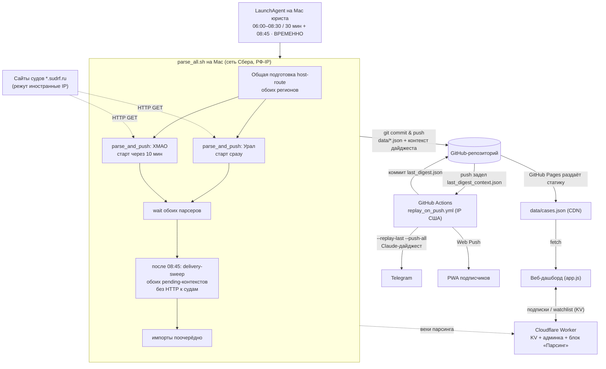

# 01. Обзор и архитектура

## Что это и зачем

Система автоматически следит за гражданскими делами с участием ПАО Сбербанк в
судах Ханты-Мансийского автономного округа — Югры и каждое утро присылает юристу
короткий **дайджест**: что нового, по каким делам прошли заседания, какие
вынесены решения и чем они грозят банку. Юристу больше не нужно вручную обходить
сайты двух десятков судов — система делает это за него и присылает выжимку в
Telegram и push-уведомлением в мобильное приложение (PWA). Полную картину по
всем делам можно посмотреть в [веб-дашборде](https://selivanovas.github.io/dashboard/sberbank_dashboard.html).

Система покрывает **три инстанции**:

- **1-я инстанция** — 20 районных и городских судов ХМАО-Югры;
- **апелляция** — Суд ХМАО-Югры;
- **кассация** — 7-й кассационный суд общей юрисдикции (фильтруем дела, пришедшие
  из судов 1-й инстанции ХМАО).

Источник данных — публичные карточки дел в ГАС «Правосудие» (поддомены
`*.sudrf.ru`). Никаких внутренних систем банка не используется.

## Из чего состоит система

| Компонент | Файл(ы) | Роль |
|-----------|---------|------|
| **Бэкенд-скрипт** | [`scripts/update_cases.py`](../../scripts/update_cases.py) | Монолит (~13 200 строк): парсеры судов, машина состояний дел, генерация дайджеста через LLM, отправка в Telegram и Web Push, CLI. Сердце системы. |
| **Данные** | [`data/cases.json`](../../data/cases.json) + архивы | Единый источник истины обо всех делах. Подробно — в [02. Модель данных](02-модель-данных.md). |
| **Фронтенд (SPA)** | [`app.js`](../../app.js), [`sberbank_dashboard.html`](../../sberbank_dashboard.html), [`styles.css`](../../styles.css) | Одностраничный дашборд без фреймворков. Читает `cases.json` напрямую с GitHub Pages. |
| **PWA** | [`manifest.json`](../../manifest.json), [`service-worker.js`](../../service-worker.js) | Превращает дашборд в устанавливаемое приложение с push-уведомлениями. |
| **Mac юриста** ⏳ *временно* | [`ops/mac-local-run/`](../../ops/mac-local-run) | Парсит обе территории по расписанию (LaunchAgent, будни 06:00–08:45 местного) и пушит данные в git. Появился 03.07.2026 из-за геоблокировки судов (см. ниже). |
| **Cloudflare Worker** | [`cloudflare-worker/worker.js`](../../cloudflare-worker/worker.js) | Хранит подписки на push и watchlist (KV), отдаёт админку подписчиков и онлайн-статус парсинга. Cron-автозапуск **отключён** (`crons = []`). |
| **GitHub Actions** | [`.github/workflows/*.yml`](../../.github/workflows) | Собирают Claude-дайджест по факту push'а данных (`replay_on_push.yml`), гоняют тесты, коммитят результат. |
| **GitHub Pages** | — | Хостинг дашборда и самих `data/*.json` (фронт качает их как статику). |

> ⚠️ **Временная схема (с 03.07.2026).** Сайты судов `*.sudrf.ru` молча дропают
> TLS-хендшейк с иностранных IP, поэтому GitHub Actions (США) больше не может
> парсить суды. Одновременно `api.anthropic.com` недоступен из РФ — поэтому
> конвейер разделён по географии: **парсинг — на Mac юриста** (сеть Сбера,
> российский IP), **Claude-дайджест и доставка — на GitHub**. Это осознанно
> временное решение: **в будущем парсинг переедет на сервер** (российский VPS —
> точечный прокси `COURT_PROXY_URL` для судов либо полный перенос прогона),
> и Mac-звено будет демонтировано. Установка/устройство/откат Mac-звена —
> [`ops/mac-local-run/README.md`](../../ops/mac-local-run/README.md).

До 03.07.2026 ключевой особенностью было полное отсутствие своего сервера
(cron Cloudflare → GitHub Actions); состояние по-прежнему живёт в JSON-файлах
в git-репозитории, статику раздаёт GitHub Pages, базы данных нет.

## Поток данных

### Пошагово (ежедневный прогон)

1. **Расписание.** LaunchAgent `com.court-monitor.parse` на Mac юриста (будни
   06:00–08:30 каждые 30 минут и последний слот 08:45; если Mac спал — при первом
   пробуждении/входе) запускает
   [`ops/mac-local-run/parse_all.sh`](../../ops/mac-local-run/parse_all.sh).
2. **Оркестрация территорий.** Драйвер один раз готовит host-route для реестров
   обоих территорий, запускает Урал сразу и ХМАО через 10 минут. Клоны имеют
   разные git-индексы, данные, логи и lock; сбой одного не отменяет второй.
   После `wait`, если уже 08:45, драйвер проверяет pending-контекст каждого
   клона и доставляет его через existing exact-once marker без повторного
   парсинга; затем начинаются импорты. Так занятый долгим вторым регионом
   LaunchAgent не зависит от пропущенного launchd-слота 08:45. Откат —
   `CM_PARALLEL_TERRITORIES=0`; `--check` намеренно идёт последовательно.
   *(До 03.07.2026 расписание держал cron Cloudflare Worker — отключён из-за
   геоблокировки судов, см. [09](09-cloudflare-worker.md).)*
3. **Запуск.** Каждая обёртка выполняет `run_parse.py` — это `main_json`
   ([`scripts/court_monitor/runs.py`](../../scripts/court_monitor/runs.py#L834))
   с заглушённой проверкой секретов: на Mac их нет, доставка штатно
   пропускается, а контекст дайджеста сохраняется для replay на GitHub.
4. **Парсинг.** Скрипт обходит источники активного региона, скачивает поисковую выдачу и
   карточки дел, разбирает HTML. См. [04. Сбор данных и парсеры](04-сбор-данных-и-парсеры.md).
5. **Обновление и связывание.** Новые события дописываются в дела, дела
   разных инстанций связываются между собой по номеру/УИД, дубликаты схлопываются.
   См. [05. Конвейер обновления](05-конвейер-обновления.md).
6. **Машина состояний.** Каждое дело продвигается по стадиям (подана жалоба →
   апелляция → кассация и т.д.), завершённые дела архивируются.
   См. [03. Жизненный цикл дела](03-жизненный-цикл-дела.md).
7. **Коммит с Mac.** Каждая обёртка коммитит обновлённые `data/*.json` (и legacy CSV)
   коммитом `📊 Обновление данных … (Mac-парсинг)` и пушит в `main` своего репозитория.
8. **Дайджест (на GitHub).** Push, задевший `data/last_digest_context.json`,
   запускает workflow [`replay_on_push.yml`](../../.github/workflows/replay_on_push.yml):
   `--replay-last --push-all` собирает HTML-дайджест из сохранённого контекста.
   Тексты решений пересказывает LLM (Claude Haiku 4.5) — **поэтому дайджест
   живёт на GitHub**: Claude недоступен с российских IP, а суды — с иностранных.
   См. [06. Дайджесты и LLM](06-дайджесты-и-llm.md).
9. **Доставка.** Оттуда же дайджест уходит в Telegram, а персонализированные
   push — подписчикам PWA (каждому — только по его отслеживаемым делам);
   `last_digest.json` докоммичивается в репозиторий.
   См. [07. Доставка и уведомления](07-доставка-и-уведомления.md).
10. **Просмотр.** Юрист открывает дашборд — `app.js` качает свежий `cases.json`
   прямо с GitHub Pages. См. [08. Фронтенд](08-фронтенд.md).

## Технологический стек

- **Бэкенд:** Python 3.12, только `requests` (HTTP) + стандартный
  `html.parser` для разбора HTML. Внешних парсер-библиотек нет.
- **LLM:** Anthropic Claude (модель `claude-haiku-4-5-20251001`) — основной;
  GigaChat (Сбер) — альтернативный, включается отдельным workflow.
- **Уведомления:** Telegram Bot API; Web Push (VAPID) через `pywebpush`.
- **Фронтенд:** ванильные HTML/CSS/JS, без сборки и фреймворков. Шрифты
  Literata / Source Sans 3 / JetBrains Mono. Состояние — `localStorage`.
- **Инфраструктура:** Mac юриста (LaunchAgent — парсинг судов; *временно*, см.
  выше), GitHub Actions (Claude-дайджест + доставка + тесты), Cloudflare Workers
  (KV-хранилище подписок, админка, онлайн-статус парсинга; cron отключён),
  GitHub Pages (хостинг). План: вернуть парсинг с Mac на сервер (RU VPS).
- **Хранилище:** JSON-файлы в git. Legacy CSV (`data/sberbank_cases.csv`) всё
  ещё пишется для обратной совместимости, но источник истины — JSON.

## Ключевые проектные решения

- **Монолит вместо модулей.** Весь бэкенд в одном файле `update_cases.py`.
  Это сознательный выбор: один файл проще деплоить в GitHub Actions и держать в
  голове при отладке. Навигацию обеспечивают карта в `CLAUDE.md` и эта документация.
- **JSON в git вместо БД.** История изменений = история коммитов; откат =
  `git revert`; бэкап встроен. Цена — файл `cases.json` нельзя растить
  бесконечно, поэтому архив разделён на «горячий» и «холодный»
  (см. [02. Модель данных](02-модель-данных.md) и
  [03. Жизненный цикл](03-жизненный-цикл-дела.md)).
- **Cloudflare Worker для расписания.** Единственная причина существования
  Worker'а изначально — точный запуск. Позже он оброс хранением push-подписок и
  watchlist, потому что фронту нужен хоть какой-то серверный endpoint, а Worker
  уже был. ⚠️ Автозапуск — **только** через Worker; cron-job.org и аналоги не
  использовать.
- **Гибридный дайджест.** HTML дайджеста собирается программно
  (детерминированно, без галлюцинаций), а LLM вызывается только на узкую задачу —
  пересказать мотивировочную часть судебного акта. Это дешевле и надёжнее, чем
  отдавать всю генерацию LLM. Старый режим «весь дайджест одним LLM-вызовом»
  остался под флагом `DIGEST_FULL_LLM=1`.

## Глоссарий

| Термин | Значение |
|--------|----------|
| **Дело** | Единица мониторинга. В `cases.json` — объект с полями инстанций. Идентифицируется номером дела 1-й инстанции (или, для «найденных в кассации», — номером кассации). |
| **Инстанция** | 1-я инстанция / апелляция / кассация. У дела есть блоки `first_instance`, `appeal`, `cassation`. |
| **Стадия (`current_stage`)** | Текущее положение дела в машине состояний: `first_instance`, `awaiting_appeal`, `appeal`, `cassation_watch`, `cassation_pending`, `cassation`, `awaiting_relink`. См. [03](03-жизненный-цикл-дела.md). |
| **Карточка дела** | HTML-страница дела на сайте суда, откуда парсятся события, даты, статус, текст акта. |
| **УИД** | Уникальный идентификатор дела (напр. `86RS0020-01-2025-000203-13`) — сквозной для всех инстанций, служит мостом для связки апелляции с кассацией. |
| **Акт** | Судебный акт (решение/определение). «Акт опубликован» = на сайте выложен полный текст с мотивировкой. |
| **Дайджест** | Ежедневная HTML-сводка изменений, отправляемая в Telegram и push. |
| **Watchlist** | Список дел, на которые подписался конкретный пользователь PWA (звёздочка ★). Push приходят персонально — только по своим делам. |
| **Discovery** | Создание дела «с нуля», когда оно впервые обнаружено сразу в кассации (карточки нижестоящих инстанций у нас не было). Поле `discovered_via_cassation`. |
| **Remanded / новый круг** | Кассация отменила и направила дело на новое рассмотрение. Дело «открывается заново»: `round` инкрементируется, прошлые блоки уезжают в `history`. |
| **Горячий / холодный архив** | Горячий (`cases_archive.json`) — дела, заархивированные за последний год, грузит фронт. Холодный (`cases_archive_YYYY.json`) — старше года, фронт не грузит. |
| **PWA** | Progressive Web App — дашборд, установленный как приложение, умеет получать push. |
