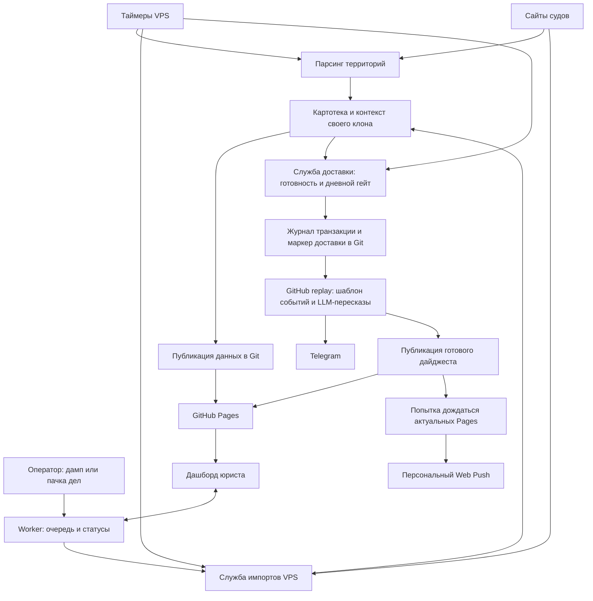

# 01. Обзор и архитектура

> **Граница версий, 14.09.2026.** Это описание среза рабочей копии 13 сентября,
> включая локально подготовленный код. В опубликованном эталоне `1a943a7f`
> уже есть полная очередь и отдельная доставка; пакет изменений Башкортостана,
> открытых президиумов, кассационных связок, времени суда и общего шлюза
> этим документационным выпуском не переносится.
> [Подробный состав](../Сверка_документации_2026-09-13.md).

## Что это и зачем

СберСуд следит за гражданскими делами банка: собирает события с сайтов судов,
показывает стадии и заседания в дашборде, готовит ежедневный дайджест и
персональные уведомления. Есть два трека: иски против банка и «Иски банка».

Этот репозиторий — эталон общего кода и картотека ХМАО. Урал (Свердловская
область и ЯНАО) и Башкортостан используют отдельные региональные копии со
своими данными, настройками и подписками. Источники каждой территории заданы
в [реестрах](../../scripts/court_monitor/regions/__init__.py): первая инстанция,
апелляционные суды, КСОЮ и президиумы. Состояние внедрения Башкортостана
зафиксировано в [датированном отчёте](../regions/Башкортостан_внедрение_2026-09-11.md).

Источник событий — публичные страницы ГАС «Правосудие» (`*.sudrf.ru`).
Недоступные поисковые разделы дополняются операторскими дампами; успешный
HTTP-ответ сам по себе не подтверждает чтение дела. Полную картину ХМАО
можно открыть в [дашборде](https://selivanovas.github.io/dashboard/sberbank_dashboard.html).

## Из чего состоит система

Описание сверено с файлами репозитория 13.09.2026. Оно показывает устройство
кода и конфигурации; состояние живых сервисов и секретов проверяется отдельно.

| Компонент | Где искать | Роль |
|---|---|---|
| Python-бэкенд | [court_monitor/](../../scripts/court_monitor/__init__.py), [update_cases.py](../../scripts/update_cases.py) | Пакет парсеров, хранения, жизненного цикла, связок, дайджеста и доставки; `update_cases.py` — тонкий CLI-фасад. |
| Картотеки | [Модель данных](02-модель-данных.md) | Основной и bank-трек, архивы, отдельные bank-events, контекст дайджеста и отчёты. |
| Фронтенд и PWA | [app.js](../../app.js), [service-worker.js](../../service-worker.js) | JSON с Pages, фильтры, карточка дела, watchlist, календарь, офлайн-кэш и push. |
| VPS | [ops/vps-run/](../../ops/vps-run/README.md) | Основной исполнитель: отдельные службы парсинга, импортов и доставки, таймеры systemd. |
| Общие скрипты и Mac | [ops/mac-local-run/](../../ops/mac-local-run/README.md) | Общая реализация для VPS и Mac-резерва; свои клоны и блокировки каждой территории. |
| Cloudflare Worker | [Документация API](09-cloudflare-worker.md) | Подписки, watchlist, календарь, роли, очередь импортов, состояние прогонов; cron в эталонной конфигурации отключён. |
| GitHub Actions | [replay_on_push.yml](../../.github/workflows/replay_on_push.yml) | Гибридный дайджест и доставка после маркера публикации данных; отдельные workflow для тестов и ручного полного запуска. |
| GitHub Pages | [Фронтенд](08-фронтенд.md) | Хостинг приложения и публичных JSON своей территории. |

## Поток данных

### Ежедневная работа

1. **Обход.** `court-parse.timer` запускает попытки по будням с 06:00 до
   08:45 по Екатеринбургу. Общий драйвер читает список территорий и запускает
   их с разнесением стартов. Данные, журналы и `.run.lock` принадлежат своему
   клону; сбой одной территории не отменяет обработку соседней.
2. **Обновление.** `run_parse.py` вызывает `main_json`: кассация → апелляция →
   первая инстанция. Парсер обновляет карточки, связывает инстанции с учётом
   суда и УИД, сохраняет события и архивы. Подробности — в
   [конвейере](05-конвейер-обновления.md).
3. **Импорты.** Поллер, дневные слоты и завершение службы парсинга запускают
   импорт отдельно. На VPS `CM_IMPORTS_AFTER_PARSE=0`: утренняя служба
   не ждёт окончания очереди. Очередь FIFO, запись в каждый клон защищена
   общей с парсингом блокировкой. Mac-резерв сохраняет импорт внутри драйвера.
4. **Готовность выпуска.** С 08:45 отдельная служба доставки проверяет готовые
   контексты, включая сегодняшний завершённый прогон без новых событий.
   Занятый клон остаётся до следующей попытки. Сам парсер и заключительный
   проход драйвера также могут вызвать тот же путь доставки; дневной гейт и
   журнал транзакций защищают его от повтора. Сначала публикуются данные,
   затем фиксируется маркер `(Mac-парсинг)` — это имя сохранено и на VPS.
5. **Дайджест.** `replay_on_push.yml` принимает push в `main` с нужным маркером,
   изменением `last_digest_context.json` и автором, отличным от
   `github-actions[bot]`. Шаблон собирает юридические события,
   LLM пересказывает мотивировки актов. В workflow без переопределения выбран
   OpenRouter; Python без env использует Claude. Это дефолты файлов,
   а не подтверждение текущих Actions Variables.
6. **Доставка и просмотр.** Replay отправляет Telegram, публикует готовый
   дайджест и отдельным шагом отправляет Web Push. Перед push он пытается
   дождаться совпадения содержимого Pages; таймаут или неудачный rebase могут
   оставить публикацию неподтверждённой. Дашборд загружает данные с Pages.

Расписания, повторы, проверка готовности и восстановление транзакции подробно
описаны в [эксплуатации](10-ci-cd-и-эксплуатация.md) и
[рантбуке VPS](../../ops/vps-run/README.md). Ручной полный запуск GitHub
остаётся аварийным путём; включение второго автоматического писателя
не входит в обычную проверку кода.

## Технологический стек

- **Бэкенд:** Python 3.12 в CI; `requests`, стандартный `html.parser`,
  `zoneinfo`, `pywebpush`. Зависимости — в
  [requirements.txt](../../scripts/requirements.txt).
- **LLM:** Claude, GigaChat и OpenRouter; выбор провайдера и кэш — в
  [главе 06](06-дайджесты-и-llm.md). Модель агента разработки не меняет
  провайдера дашборда.
- **Фронтенд:** HTML/CSS/JavaScript без сборки; PWA, `localStorage`,
  персональные подписки и календарь через Worker.
- **Инфраструктура:** VPS/systemd, Mac-резерв, GitHub Actions/Pages,
  Cloudflare Workers/KV.
- **Хранение:** JSON в Git; bank-events сохраняются отдельно от основной
  bank-картотеки. CSV поддерживается как legacy-формат.

## Ключевые проектные решения

- **Общий код, отдельные территории.** Реестры и часовые пояса задаются
  конфигурацией; данные, Worker/KV, настройки браузера и секреты не смешиваются.
  Правила merge — в [документе о регионах](../Тиражирование_регионы.md).
- **Картотека в Git.** История коммитов сохраняет изменения данных, архивы
  ограничивают размер загружаемой картотеки. Откат данных требует учитывать
  связанные события и маркеры доставки.
- **Разделение исполнения.** VPS читает суды и очередь, GitHub готовит
  дайджест и уведомления. Worker обслуживает интерфейс и состояние, его
  отключённый cron не является текущим расписанием VPS.
- **Гибридный дайджест.** Структуру и цифры собирает код; LLM получает
  мотивировку конкретного акта. Полный LLM-режим включается отдельно.
- **Разные понятия времени.** Метки `updated_at` картотеки и отчёта здоровья
  содержат часовое смещение;
  заседание показывается по времени суда. Для суда с другим поясом добавляется
  подпись, а календарные события с известным временем переводятся в UTC.

## Глоссарий

| Термин | Значение |
|--------|----------|
| **Дело** | Единица мониторинга. В `cases.json` — объект с полями инстанций. Номер учитывается вместе с судом и УИД; один номер может встречаться в разных судах. |
| **Инстанция** | 1-я инстанция / апелляция / кассация. У дела есть блоки `first_instance`, `appeal`, `cassation`. |
| **Стадия (`current_stage`)** | Текущее положение дела в машине состояний: `first_instance`, `awaiting_appeal`, `appeal`, `cassation_watch`, `cassation_pending`, `cassation`, `awaiting_relink`. См. [03](03-жизненный-цикл-дела.md). |
| **Карточка дела** | HTML-страница дела на сайте суда, откуда парсятся события, даты, статус, текст акта. |
| **УИД** | Уникальный идентификатор дела (напр. `86RS0020-01-2025-000203-13`) — сквозной для всех инстанций, служит мостом для связки апелляции с кассацией. |
| **Акт** | Судебный акт (решение/определение). «Акт опубликован» = на сайте выложен полный текст с мотивировкой. |
| **Дайджест** | Ежедневная HTML-сводка изменений, отправляемая в Telegram и push. |
| **Watchlist** | Список дел, на которые подписался конкретный пользователь PWA (звёздочка ★). Push приходят персонально — только по своим делам. |
| **Discovery** | Создание дела «с нуля», когда оно впервые обнаружено сразу в кассации (карточки нижестоящих инстанций у нас не было). Поле `discovered_via_cassation`. |
| **Remanded / новый круг** | Кассация отменила и направила дело на новое рассмотрение. Дело «открывается заново»: `round` инкрементируется, прошлые блоки уезжают в `history`. |
| **Горячий / холодный архив** | Горячий (`cases_archive.json`) — дела, заархивированные за последний год, грузит фронт. Холодный (`cases_archive_YYYY.json`) — старше года, фронт не грузит. |
| **PWA** | Progressive Web App — дашборд, установленный как приложение, умеет получать push. |
