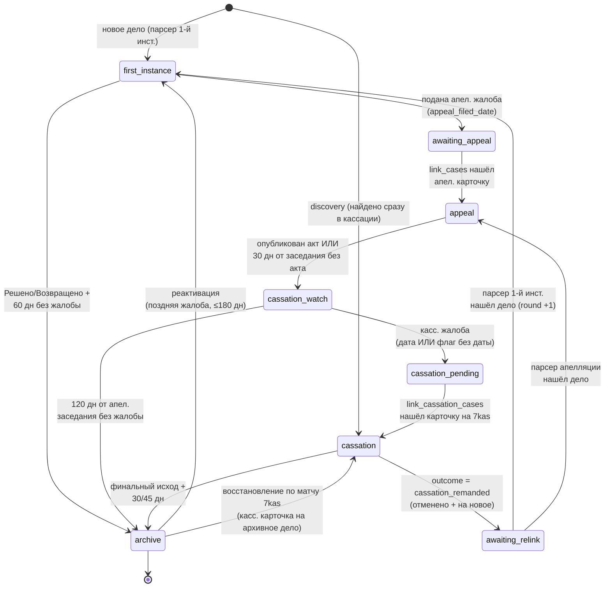

# 03. Жизненный цикл дела

## Что это и зачем

Дело не статично: оно проходит путь от поступления в суд 1-й инстанции до
кассации, а иногда возвращается на новый круг. Чтобы система знала, **какую
карточку парсить** в каждый момент и **когда дело можно убрать из активных**,
у каждого дела есть «стадия» (`current_stage`) — это конечный автомат (state
machine).

Зачем это юристу: стадия определяет, что система делает с делом прямо сейчас
(следит за 1-й инстанцией? ждёт апелляцию? проверяет кассацию?) и почему дело
в какой-то момент исчезает из дашборда (ушло в архив по тайм-ауту). Зачем
разработчику: вся логика переходов сосредоточена в трёх функциях, и менять
тайм-ауты нужно согласованно с фронтом.

## Семь стадий + архив

| Стадия | Что система парсит | Архивируется по времени? |
|--------|--------------------|--------------------------|
| `first_instance` | Карточку 1-й инстанции | Да — 60 дн без жалобы |
| `awaiting_appeal` | Карточку 1-й инст. — пока не `sent_to_appeal`; затем ничего (ждём карточку в апелляции) | Нет |
| `appeal` | Карточку апелляционного суда | Нет (только переход дальше) |
| `cassation_watch` | Карточку 1-й инст. (ищем кассационную жалобу) — кроме дел, где банк «Третье лицо» (не парсим, ждём дело на 7kas) | Да — 120 дн без жалобы |
| `cassation_pending` | Карточку 1-й инст. — пока не `sent_to_cassation`; затем ничего (ждём карточку на 7kas) | Нет |
| `cassation` | Карточку 7-го КСОЮ | Да — после публикации/вынесения акта |
| `awaiting_relink` | Ничего (ждём карточку в нижестоящей инст. после отмены) | Нет |

Что именно парсим на прогоне, решает `should_parse_fi_card` в
[lifecycle.py](../../scripts/court_monitor/lifecycle.py). В `awaiting_appeal`/
`cassation_pending` карточку 1-й инст. парсим **до** фиксации отправки дела
наверх (`sent_to_appeal` / `sent_to_cassation`): после подачи жалобы юрист
хочет и дальше видеть движение по карточке 1-й инст. («направлено в
кассацию/апелляцию», жалоба возвращена/оставлена без движения). Как только
дело ушло в вышестоящий суд — прекращаем парсить и ждём появления карточки там
(`link_cases` / `link_cassation_cases`). Тот же предикат гейтит
`backfill_fi_links` (достройку ссылки на карточку 1-й инст.).

В `cassation_watch` дела, где банк — **третье лицо**, не парсим вовсе
(решение юриста 13.07.2026: таких дел ~треть группы, а ежедневный парсинг
120-дневного окна ради раннего предупреждения о чужой кассации не окупается).
Кассацию по ним обнаружит поиск 7kas по имени банка среди всех участников:
`link_cassation_cases` переведёт активное дело `cassation_watch → cassation`
(«догоняем») либо воскресит уже заархивированное из горячего архива со всей
историей. Теряется только раннее событие `fi_cassation_filed`; 120-дневное
окно архивации работает как обычно (`is_case_archived` от парсинга не
зависит). Пустая/нераспознанная роль → парсим (безопасный дефолт,
`bank_is_third_party`).

## Диаграмма переходов

## Три функции, управляющие циклом

Вся логика — в [`scripts/update_cases.py`](../../scripts/update_cases.py):

### `advance_case_stage(case)` — продвижение вперёд
[Строка 1755](../../scripts/court_monitor/lifecycle.py#L1755). Смотрит на поля дела и при
выполнении условия меняет `current_stage`, возвращая имя прежней стадии (или
`None`). Отвечает за переходы:

- `first_instance → awaiting_appeal` — появилось `first_instance.appeal_filed_date`;
- `appeal → cassation_watch` — есть `appeal.act_date`, **или** прошло
  `APPEAL_NO_ACT_GRACE_DAYS` (30) дней от апелляционного заседания без акта;
- `cassation_watch → cassation_pending` — есть `cassation_filed_date` /
  `sent_to_cassation_date` **или флаг** `cassation_filed` / `sent_to_cassation`
  без даты (короткая вкладка «Обжалование» умеет показать жалобу без «Даты
  поступления» — без перехода по флагу дело зависало и уходило в архив с
  поданной жалобой). Попутно проставляет `cassation_pending_since`;
- `cassation → awaiting_relink` — `cassation.outcome == "cassation_remanded"`.

Переходы `awaiting_appeal → appeal`, `cassation_pending → cassation` и
`awaiting_relink → first_instance/appeal` **здесь не делаются** — они зависят от
появления новой карточки и выполняются функциями связывания (см. ниже).

### `is_case_archived(case)` — пора ли в архив
[Строка 1836](../../scripts/court_monitor/lifecycle.py#L1836). Унифицированная проверка по
стадии. Возвращает `true`, если дело можно архивировать:

- `first_instance`: статус `Решено`/`Возвращено` **и** прошло `FI_ARCHIVE_DAYS`
  (60) дней от `hearing_date`, **и** нет признаков поданной жалобы. Есть защита:
  если стоит флаг жалобы, но дата не извлеклась — дело держим в активных
  (см. кейс `2-208/2026` в комментарии кода). Если `hearing_date` пуст, окно
  считается от `event_date` (дата последнего события карточки) — запасной якорь
  для исков, возвращённых на стадии принятия: заседания у них не было, а строку
  «Решение вопроса о принятии иска → Возвращение искового заявления» парсер
  намеренно не берёт за дату решения (`_ACCEPTANCE_RX`, иначе у свежепринятых
  дел появлялась фантомная «дата заседания»). Без запасного якоря такое дело
  висело в активных вечно и опрашивалось каждый прогон — кейс `9-1012/2026`.
  Обе даты пусты → не архивируем. То же правило действует на фронте
  (`isArchived` в [app.js](../../app.js) считает от `lastEventDate`);
- `cassation_watch`: прошло `CASSATION_WATCH_DAYS` (120) дней от апелляционного
  заседания без кассационной жалобы. Та же защита от «флага без даты», что и в
  `first_instance`: любой признак касс. жалобы исключает архивацию (страховка —
  в норме `advance_case_stage` уже перевёл бы такое дело в `cassation_pending`);
- `cassation`: исход финальный (не `cassation_remanded` и не `cassation_other`)
  **и** прошло `CASSATION_ACT_ARCHIVE_DAYS` (30) дней после публикации акта,
  **или** `CASSATION_NO_ACT_PUBLISH_DAYS` (45) дней от даты вынесения определения
  без публикации текста;
- `awaiting_appeal`, `appeal`, `cassation_pending`, `awaiting_relink`: **никогда**
  не архивируются по времени (ждём бессрочно).

Разделение активных и архивных по этой проверке делает `split_archived_json`
([строка 3242](../../scripts/court_monitor/lifecycle.py#L3242)).

### `migrate_stages(cases)` — идемпотентная миграция
[Строка 2068](../../scripts/court_monitor/lifecycle.py#L2068). Прогоняет `advance_case_stage`
в цикле, пока есть переходы, — подтягивает старые записи (созданные до появления
state-machine) под текущую модель. Запускается при каждом прогоне, выполнять
повторно безопасно. Заодно бэкфиллит `initial_bank_role` и чистит устаревший
`suspended_until` в кассации. Анти-паводковые посевы эмит-маркеров: истёкший
срок возражений (`objections_emitted`), возврат копии заочного
(`default_copy_returned_emitted`) и — с 13.08.2026 — её вручение
(`default_copy_served_emitted`). ⚠️ Календарные маркеры трека
(`legal_force_emitted`/`writ_overdue_emitted`) здесь НЕ сеются намеренно:
расчётная дата пересекает «сегодня» без изменения данных карточки, и вечный
посев на загрузке (раньше календарного прохода) глушил бы события в день
наступления — их анти-паводок живёт в эпохе `BANK_CALENDAR_EVENTS_SINCE`
внутри `collect_bank_calendar_events` (runs.py).

## Константы тайм-аутов

[Строки 300–330](../../scripts/court_monitor/config.py#L99):

| Константа | Значение | Где применяется |
|-----------|----------|-----------------|
| `FI_ARCHIVE_DAYS` | 60 | 1-я инст. → архив без жалобы. Раньше 45; увеличено, т.к. мотивировка задерживается + срок на жалобу + лаг парсера. |
| `APPEAL_NO_ACT_GRACE_DAYS` | 30 | appeal → cassation_watch без опубликованного акта. |
| `CASSATION_WATCH_DAYS` | 120 | cassation_watch → архив (≈3 мес срок + почта + регистрация). |
| `CASSATION_ACT_ARCHIVE_DAYS` | 30 | cassation → архив после публикации акта. |
| `CASSATION_NO_ACT_PUBLISH_DAYS` | 45 | cassation → архив без публикации акта. |
| `COLD_ARCHIVE_DAYS` | 365 | Граница горячий/холодный архив. |

> ⚠️ **Фронт держит свою копию `ARCHIVE_DAYS`** в [`app.js`](../../app.js).
> При изменении `FI_ARCHIVE_DAYS` синхронизировать вручную, иначе дашборд начнёт
> прятать дела раньше (или позже), чем их архивирует парсер.

## Архивация, ротация и возврат

### Архивация
В конце прогона `split_archived_json` делит дела на активные и архивные по
`is_case_archived`. Архивным проставляется `archived_at`. Активные пишутся в
`cases.json`, архивные добавляются в горячий `cases_archive.json`.

### Ротация в холодный архив
`rotate_cold_archive(hot_archive)` ([строка 1191](../../scripts/court_monitor/linking.py#L1191))
выносит дела старше `COLD_ARCHIVE_DAYS` (по `archived_at`) из горячего архива в
годовые `cases_archive_YYYY.json`. Делам без штампа `archived_at` он выводится из
самой поздней даты стадий (`_infer_archived_at`) и записывается обратно
(считается один раз). Идемпотентно: дело дописывается в холодный файл, только если
его там ещё нет. Фронт холодные файлы не грузит. Подробнее — в
[02. Модель данных](02-модель-данных.md).

### Реактивация из архива — два канала
1. `reactivate_archived_first_instance(cases, archived_cases)`
   ([строка 441](../../scripts/court_monitor/linking.py#L441)) подмешивает обратно в
   активные **недавние** (≤180 дней от `hearing_date`) дела 1-й инстанции со
   статусом `Решено`, чтобы парсер перечитал карточку и поймал **поздно поданную**
   жалобу. Если жалоба найдётся — `advance_case_stage` уведёт дело в
   `awaiting_appeal`, и оно останется активным; если нет — `split_archived_json`
   вернёт его в архив тем же прогоном. Отдельного события в дайджесте нет —
   срабатывает обычное «подана апел. жалоба».
2. `link_cassation_cases` с переданным горячим архивом: если карточка 7kas
   сматчилась с **архивным** делом (например, оно ушло из `cassation_watch` по
   120-дневному окну, а кассационная жалоба зарегистрировалась ещё позже) —
   дело восстанавливается в активные со всей историей и сторонами вместо
   создания discovery-дубля. Штамп `archived_at` при этом снимается: при
   повторном уходе в архив дело получит свежий якорь ротации.

Оба канала работают только по горячему архиву (холодные дела «заморожены»,
возврат — вручную через `add_cases_manually.py`).

### Повторный круг после отмены кассацией
Если `cassation.outcome == "cassation_remanded"`, дело переходит в
`awaiting_relink`. Когда парсер нижестоящей инстанции снова видит карточку этого
дела:

- 1-я инстанция → `relink_awaiting_relink_first_instance`
  ([строка 234](../../scripts/court_monitor/linking.py#L234)) вызывает
  `_snapshot_round_to_history` (прошлые блоки → `history`, `round += 1`,
  блоки инстанций обнуляются), ставит `current_stage = "first_instance"` и
  инициализирует новый блок `first_instance`. Номера матчятся с нормализацией
  через `_bare_case_number` с обеих сторон: «гибридный» id
  (`2-208/2026 (2-1148/2025;)`) находит короткую форму из выдачи и наоборот;
- апелляция → дело подцепляет `link_cases` (ветка `awaiting_relink` со
  снимком раунда).

**Защита от «воскрешения» прошлого круга:** старая карточка 7kas ещё месяцами
остаётся в выдаче поиска. Карточки, чей `8Г`-номер уже лежит в `history` дела,
`link_cassation_cases` пропускает — иначе прошлый круг перезаписывал бы
кассационный блок нового, давал ложное «новая кассация» и наращивал `round`
на каждом прогоне. Дело в `awaiting_relink` при повторном матче той же карточки
обновляет блок (например, поздняя публикация текста определения), но стадию
назад в `cassation` не меняет.

Связыванием инстанций (`link_cases`, `link_cassation_cases`) и порядком вызова
всех этих функций в прогоне занимается [05. Конвейер обновления](05-конвейер-обновления.md).

## Где это видно юристу

- Стадия отображается бейджем в карточке/строке дашборда (`stageBadgeHtml` в
  `app.js`).
- Уход в архив = дело пропадает из основного списка и переезжает во вкладку
  «Архив» (пока оно в горячем архиве, т.е. younger than год).
- Возврат из архива и новый круг проявляются как обычные события дайджеста.
