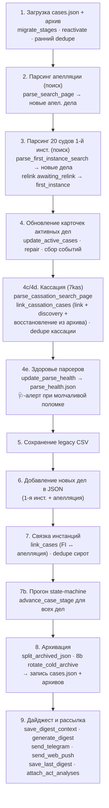

# 05. Конвейер обновления (`main_json`)

## Что это и зачем

Это «дирижёр» — функция, которая за один утренний прогон делает всё: грузит
текущие данные, обходит суды, обновляет дела, связывает инстанции, продвигает
стадии, архивирует завершённые, собирает дайджест и рассылает его. Парсеры из
[04](04-сбор-данных-и-парсеры.md) и машина состояний из [03](03-жизненный-цикл-дела.md)
— это «органы», а `main_json` — нервная система, которая включает их в строго
определённом порядке.

Порядок шагов **важен**: дедупликация должна идти после связывания, архивация —
после продвижения стадий, дайджест — в самом конце, когда все изменения уже
накоплены. Понимание этого порядка нужно, чтобы безопасно вставлять новую логику.

`main_json` — [`scripts/court_monitor/runs.py:1627`](../../scripts/court_monitor/runs.py#L1627).
Запускается как `python update_cases.py --json`. Флаг `--smart-skip` (или env
`SKIP_NON_WORKING_DAYS=1` — его передаёт крон) включает пропуск нерабочих дней
РФ и дел с известной будущей датой; без флага — полный прогон всех активных
карточек (выключатель — `config.SMART_SKIP_CASES`).

## Карта прогона

## Шаги подробно

Номера соответствуют комментариям-баннерам в коде.

### 1. Загрузка и подготовка ([1658](../../scripts/court_monitor/runs.py#L1658))
Читаются `cases.json` и горячий архив. Затем — идемпотентная гигиена:
<<<<<<< HEAD
`migrate_stages` ([1842](../../scripts/court_monitor/runs.py#L1842)) подтягивает
старые записи под текущую модель; `reactivate_archived_first_instance`
([1861](../../scripts/court_monitor/runs.py#L1861)) подмешивает недавние архивные
дела для перепроверки поздней жалобы; ранние `dedupe_orphan_by_base_number`
([1872](../../scripts/court_monitor/runs.py#L1872)) и
=======
`migrate_stages` ([1842](../../scripts/court_monitor/runs.py#L1842)) подтягивает
старые записи под текущую модель; `reactivate_archived_first_instance`
([1861](../../scripts/court_monitor/runs.py#L1861)) подмешивает недавние архивные
дела для перепроверки поздней жалобы; ранние `dedupe_orphan_by_base_number`
([1872](../../scripts/court_monitor/runs.py#L1872)) и
>>>>>>> claude/vibrant-cannon-namvk0
`dedupe_cassation_by_internal_number` чистят накопившихся двойников. Сюда же
подмешиваются id холодных архивов в индекс дедупликации (`existing_ids`),
чтобы старое дело не всплыло как новое.

### 2. Парсинг апелляции ([1777](../../scripts/court_monitor/runs.py#L1777))
<<<<<<< HEAD
`parse_search_page` ([1929](../../scripts/court_monitor/runs.py#L1929)) ищет дела
=======
`parse_search_page` ([1929](../../scripts/court_monitor/runs.py#L1929)) ищет дела
>>>>>>> claude/vibrant-cannon-namvk0
Сбербанка в Суде ХМАО-Югры. Новые (которых ещё нет в базе) откладываются как
`appeal_new_cases_csv`. Количество строк выдачи уходит в наблюдения детектора
здоровья (шаг 4e).

### 3. Парсинг 20 судов 1-й инстанции ([1869](../../scripts/court_monitor/runs.py#L1869))
Цикл по `FIRST_INSTANCE_COURTS`: `parse_first_instance_search`
<<<<<<< HEAD
([2027](../../scripts/court_monitor/runs.py#L2027)) для каждого; в детектор
=======
([2026](../../scripts/court_monitor/runs.py#L2026)) для каждого; в детектор
>>>>>>> claude/vibrant-cannon-namvk0
здоровья уходит не длина результата, а `stats["sber_rows"]` — сберовские
строки выдачи **до** фильтра «банк-ответчик» (или факт «страница не
загрузилась»). Иначе вал исков самого банка, вытеснив ответчик-дела со
страницы 1, обнуляет метрику без всякой поломки — ложный 🩺-алерт по
Октябрьскому р/с 14–15.07.2026. Новые дела — `fi_new_cases`. Результаты по судам собираются в
`fi_results_by_court`, и сразу же `relink_awaiting_relink_first_instance`
<<<<<<< HEAD
([2125](../../scripts/court_monitor/runs.py#L2125)) возвращает в `first_instance`
=======
([2124](../../scripts/court_monitor/runs.py#L2124)) возвращает в `first_instance`
>>>>>>> claude/vibrant-cannon-namvk0
дела, ждавшие нового круга после отмены кассацией (номера матчятся с
нормализацией `_bare_case_number` — «гибридный» id находит короткую форму).

### 4. Обновление карточек активных дел ([2023](../../scripts/court_monitor/runs.py#L2023))
<<<<<<< HEAD
`update_active_cases` ([2153](../../scripts/court_monitor/runs.py#L2153)) — обходит
=======
`update_active_cases` ([2153](../../scripts/court_monitor/runs.py#L2153)) — обходит
>>>>>>> claude/vibrant-cannon-namvk0
карточки всех активных дел, дочитывает события, результаты, тексты актов, флаги
жалоб; формирует список `changes`. Поддерживает **smart-skip**: дело с известной
будущей датой заседания не перезапрашивается (экономия запросов); действует
только при `config.SMART_SKIP_CASES=True` — ручной прогон без галки идёт полным.
<<<<<<< HEAD
`repair_spurious_fi_resolutions` ([2226](../../scripts/court_monitor/runs.py#L2226))
=======
`repair_spurious_fi_resolutions` ([2226](../../scripts/court_monitor/runs.py#L2226))
>>>>>>> claude/vibrant-cannon-namvk0
чинит ложные «дело решено», если в карточке есть будущее заседание.

Набор дел для парсинга карточки 1-й инст. (`fi_active`) определяет предикат
`should_parse_fi_card` ([lifecycle.py](../../scripts/court_monitor/lifecycle.py)):
`first_instance`, `cassation_watch`, а также `awaiting_appeal`/`cassation_pending`
— но только ПОКА дело не направлено в вышестоящий суд (`sent_to_appeal` /
`sent_to_cassation`). Так после подачи жалобы мы продолжаем следить за карточкой
1-й инст. (ловим «направлено в кассацию/апелляцию», возврат/оставление жалобы),
а как дело ушло наверх — прекращаем и ждём карточку в вышестоящем суде.
Исключение: в `cassation_watch` дела с ролью банка «Третье лицо» не парсим —
кассацию по ним найдёт поиск 7kas (см. [03-жизненный-цикл-дела.md](03-жизненный-цикл-дела.md));
количество пропущенных печатается отдельной INFO-строкой перед циклом.

Перед циклом карточек 1-й инст. — `backfill_fi_links`
([linking.py:300](../../scripts/court_monitor/linking.py#L300)): у дел, пришедших
в мониторинг «сверху» (через поиск апелляции), `first_instance.link`/`court_domain`
пусты — их проставляет только `_fi_search_to_json_case` при первичном обнаружении
поиском 1-й инст. Без ссылки цикл молча пропускает дело, и стадия
`cassation_watch` слепнет к подаче касс. жалобы (инцидент 2-716/2025,
«Кассационное представление»). Бэкфилл дёргает целевой поиск по номеру дела
(`CourtConfig.search_by_number_url`, поле `G1_CASE__CASE_NUMBERSS` — проверено
вживую 06.07.2026), строку выдачи с точной границей номера разбирает
`find_fi_case_link`. Кэп 60 запросов на прогон; ссылка персистится — запрос
одноразовый на дело. Общий свип тут не помогает: он качает только первую
страницу выдачи (сортировка по дате поступления), старые дела туда не попадают.

Дальше —
обновление полей `first_instance` ([2296](../../scripts/court_monitor/runs.py#L2296)),
**пересчёт роли банка** по участникам ([2412](../../scripts/court_monitor/runs.py#L2412)),
и сборка событий для дайджеста ([3017](../../scripts/court_monitor/runs.py#L3017)):
`fi_changes`, `stage_transitions`.

Порядок блоков эмиссии внутри цикла — **load-bearing**, каждый следующий
смотрит на предыдущие:

1. **процессуальное завершение** (`fi_termination_details` → `fi_returned`):
   возврат иска / отказ в принятии / передача по подсудности. Стоит ДО
   hearing-блока намеренно — при заполненном поле «Результат» карточка ставит
   статус «Решено», `case_decided` глушит hearing-блок, а прежний `fi_returned`
   жил только внутри него (ветка «фантомной даты заседания»). Эмит гейтится
   СТАТУСОМ карточки («Решено» с термин-результатом / «Возвращено») — у живого
   дела старый возврат в истории движения не считается завершением, непустой
   «Результат» по существу — единственный арбитр, события про встречный иск
   игнорируются. Эмит ставит `termination_emitted` + `resolved_emitted` —
   последний навсегда закрывает канал 3.5, чтобы завершение не пришло вторым
   сообщением как «вынесено решение» (инцидент 9-336/2026, см.
   [06-дайджесты-и-llm.md](06-дайджесты-и-llm.md)). Флаги сбрасываются, если
   завершение оказалось отменённым: `spurious_resolution`/
   `repair_spurious_fi_resolutions` (терминальный статус + будущее заседание)
   и промоушен М→2 (иск принят после возврата);
2. hearing-блок (`fi_hearing_*`) — при уже эмитнутом завершении не выдаёт
   ложное «назначено первое заседание» на дату определения;
3. отложенный `fi_status_change` — гасится при `fi_returned` и при голом
   переходе «В производстве → Решено» без содержательного исхода;
4. `fi_resolved` / `fi_act_published` / `fi_act_text_published`;
5. `fi_final_event` — не эмитится, если его текст матчит
   `_TERMINAL_FI_EVENT_RX`, а исход дела уже показан (в этом прогоне или в
   прошлом — флаги `fi["termination_emitted"]` / `fi["resolved_emitted"]`).

Порядок и закрытие обоих каналов стережёт `TestFiTerminationWiring`
(scripts/tests/test_parsing.py) — unit-тест на исходник, по образцу
wiring-теста bank-трека.

### 4c/4d. Кассация ([3091](../../scripts/court_monitor/runs.py#L3091))
<<<<<<< HEAD
`parse_cassation_search_page` ([3317](../../scripts/court_monitor/runs.py#L3317))
ищет дела на 7kas (с HMAO-фильтром; в детектор здоровья уходят **два** счётчика —
вся выдача и после HMAO-фильтра, второй ловит слетевший матчер судов, класс
бага «Берёзовский» ё/е). `link_cassation_cases`
([3440](../../scripts/court_monitor/runs.py#L3440)) связывает находки с делами в
=======
`parse_cassation_search_page` ([3317](../../scripts/court_monitor/runs.py#L3317))
ищет дела на 7kas (с HMAO-фильтром; в детектор здоровья уходят **два** счётчика —
вся выдача и после HMAO-фильтра, второй ловит слетевший матчер судов, класс
бага «Берёзовский» ё/е). `link_cassation_cases`
([3440](../../scripts/court_monitor/runs.py#L3440)) связывает находки с делами в
>>>>>>> claude/vibrant-cannon-namvk0
базе, **создаёт новые** (discovery, если 1-инст. номера у нас не было) или
**восстанавливает дело из горячего архива** (архив передаётся параметром;
восстановление вместо discovery-дубля, штамп `archived_at` снимается). Здесь же:

- защита от «воскрешения» прошлого круга — карточки, чей `8Г`-номер уже лежит
  в `history` дела, пропускаются (см. [03](03-жизненный-цикл-дела.md));
- дедуп определений через `data/.cassation_acts` — повторный `new_act` по уже
  обработанному определению («мигание» `act_published` из-за сбойного парса)
  в дайджест не уходит;
- **бэкфилл сторон** из таблицы УЧАСТНИКИ карточки 7kas (`parties_from_participants`):
  пустые `plaintiff`/`defendant`/`bank_role` дозаполняются на каждом прогоне,
  непустые не перезаписываются (карточка 1-й инст. точнее). Нужен для
  discovery-дел: карточку 1-й инстанции на стадии `cassation` мы не парсим, а у
  капчёвых судов (`search_gated`) её и не найти — дело оставалось без сторон
  навсегда, и запись в дайджесте вырождалась в голый `8Г`-номер
  (инцидент 24.07.2026, 8Г-12479/2026 на территории Урал). Разбор ролей шире
  ИСТЕЦ/ОТВЕТЧИК: понимает ЗАЯВИТЕЛЬ/ВЗЫСКАТЕЛЬ и ЗАИНТЕРЕСОВАННОЕ ЛИЦО/ДОЛЖНИК
  (приказное и особое производство), точные роли имеют приоритет над синонимами.

Раздел 4d ([3266](../../scripts/court_monitor/runs.py#L3266)) делает refresh уже
известных кассационных карточек (по `cassation.link`). После обоих вызовов —
резервный щит дедупликации — два идемпотентных прохода:
`dedupe_cassation_by_internal_number` и `dedupe_cassation_by_uid`
(оба вызываются здесь же, в фазе кассации).

### 4e. Здоровье парсеров ([3438](../../scripts/court_monitor/runs.py#L3438))
`update_parse_health` сравнивает наблюдения прогона (сколько строк дал поиск
каждого источника; `None` — страница не загрузилась) с историей в
`data/parse_health.json` и собирает алерты: источник с медианой ≥1 вернул 0
(на 1-м и 3-м нулевом прогоне + сообщение о восстановлении), HTTP-фейл 3 прогона
подряд, все источники разом по нулям, ≥5 карточек-«огрызков» за прогон
(счётчик `METRICS["cards_degraded"]`). Алерты уходят сервисным 🩺-сообщением в
Telegram. Детектор обёрнут в try/except и не может уронить прогон. Смысл:
смена вёрстки суда без детектора неотличима от «сегодня нет новостей».

### 5. Сохранение legacy CSV ([3482](../../scripts/court_monitor/runs.py#L3482))
Активные и архивные дела апелляции пишутся в CSV для обратной совместимости.

### 6. Новые дела → JSON ([3500](../../scripts/court_monitor/runs.py#L3500))
Новые дела 1-й инстанции добавляются в `cases`. Шаг 6b
([3523](../../scripts/court_monitor/runs.py#L3523)) добавляет новые апелляционные
дела в JSON — **до** связки, иначе `link_cases` их не увидит.

<<<<<<< HEAD
### 7. Связка инстанций ([3740](../../scripts/court_monitor/runs.py#L3740))
`link_cases` ([3740](../../scripts/court_monitor/runs.py#L3740)) сшивает
=======
### 7. Связка инстанций ([3668](../../scripts/court_monitor/runs.py#L3668))
`link_cases` ([3740](../../scripts/court_monitor/runs.py#L3740)) сшивает
>>>>>>> claude/vibrant-cannon-namvk0
апелляционные дела с их записями 1-й инстанции по номеру (с учётом «гибридных»
номеров через `_bare_case_number`). Содержательная апелляция защищена от
перезаписи: если у дела уже есть апел. блок с данными (акт/события/результат),
а пришла карточка с **другим** апел. номером (обычно частная жалоба на
определение) — слияние пропускается, вторая карточка остаётся отдельной
записью. После — `dedupe_orphan_by_base_number`
<<<<<<< HEAD
([3747](../../scripts/court_monitor/runs.py#L3747)) убирает оставшихся «сирот».
=======
([3675](../../scripts/court_monitor/runs.py#L3675)) убирает оставшихся «сирот».
>>>>>>> claude/vibrant-cannon-namvk0

### 7b. Прогон машины состояний ([3574](../../scripts/court_monitor/runs.py#L3574))
`advance_case_stage` прогоняется для всех дел — переводит стадии по новым данным
(подана жалоба → `awaiting_appeal`, акт апелляции → `cassation_watch` и т.д.).

### 8. Архивация и ротация ([3652](../../scripts/court_monitor/runs.py#L3652))
<<<<<<< HEAD
`split_archived_json` ([3851](../../scripts/court_monitor/runs.py#L3851)) делит дела
на активные/архивные по `is_case_archived`. Шаг 8b `rotate_cold_archive`
([3898](../../scripts/court_monitor/runs.py#L3898)) выносит дела старше года в
=======
`split_archived_json` ([3851](../../scripts/court_monitor/runs.py#L3851)) делит дела
на активные/архивные по `is_case_archived`. Шаг 8b `rotate_cold_archive`
([3898](../../scripts/court_monitor/runs.py#L3898)) выносит дела старше года в
>>>>>>> claude/vibrant-cannon-namvk0
холодные годовые файлы. Архивный файл пересохраняется и при «чистом»
восстановлении дел кассацией (см. 4c). Затем записываются `cases_archive.json`
и `cases.json`.

### 9. Дайджест и рассылка ([3720](../../scripts/court_monitor/runs.py#L3720))
Считаются счётчики активных дел по инстанциям. `save_digest_context`
<<<<<<< HEAD
([3942](../../scripts/court_monitor/runs.py#L3942)) сохраняет снимок контекста
(для `--replay-last` и фронтового `?mine=1`). `generate_digest`
([3952](../../scripts/court_monitor/runs.py#L3952)) собирает HTML.
`send_telegram` ([3968](../../scripts/court_monitor/runs.py#L3968)) и
=======
([3870](../../scripts/court_monitor/runs.py#L3870)) сохраняет снимок контекста
(для `--replay-last` и фронтового `?mine=1`). `generate_digest`
([3952](../../scripts/court_monitor/runs.py#L3952)) собирает HTML.
`send_telegram` ([3968](../../scripts/court_monitor/runs.py#L3968)) и
>>>>>>> claude/vibrant-cannon-namvk0
`send_web_push` рассылают. `save_last_digest` кладёт готовый HTML для фронта.
`attach_act_analyses` дописывает LLM-разбор актов в дела и **повторно**
сохраняет `cases.json`.
Подробно про дайджест — [06](06-дайджесты-и-llm.md), про рассылку — [07](07-доставка-и-уведомления.md).

## Из чего собирается дайджест

К шагу 9 в памяти накоплены раздельные списки событий — они и есть «вход»
дайджеста:

| Список | Откуда | Что это |
|--------|--------|---------|
| `fi_new_cases` | шаг 3 | Новые дела 1-й инстанции. |
| `appeal_new_cases_csv` | шаг 2 | Новые дела апелляции. |
| `changes` | `update_active_cases` (шаг 4) | Изменения по апелляционным делам. |
| `fi_changes` | шаг 4 | Изменения по делам 1-й инстанции. |
| `stage_transitions` | шаги 4/7b | Переходы стадий (подана жалоба, в кассацию и т.п.). |
| `cass_changes` | шаг 4c/4d | Изменения по кассации. |
| `cass_discovered` | шаг 4c | Дела, впервые найденные в кассации (discovery). |
| `total_active_*` | шаг 9 | Счётчики активных дел по инстанциям (для «Сводки»). |

> **Новые дела общесистемны.** `fi_new_cases` и `appeal_new_cases_csv` в push
> рассылаются всем подписчикам, а изменения/переходы — только по watchlist
> конкретного подписчика. См. [07. Доставка и уведомления](07-доставка-и-уведомления.md).

## Связывание инстанций — три «сшивателя»

| Функция | Строка | Связывает |
|---------|--------|-----------|
| `link_cases` | [52](../../scripts/court_monitor/linking.py#L52) | 1-я инстанция ↔ апелляция (по номеру дела 1-й инст. из апел. карточки). Не затирает содержательную апелляцию второй карточкой с другим номером (частная жалоба). |
| `link_cassation_cases` | [529](../../scripts/court_monitor/linking.py#L529) | существующие дела ↔ кассация на 7kas; **создаёт discovery-дела** или **восстанавливает из горячего архива**. Индексирует по fi-номеру, по `cassation.case_number` (`8Г-…`) и по УИД; guard прошлого круга по `history`; дедуп определений `.cassation_acts`. |
| `relink_awaiting_relink_first_instance` | [232](../../scripts/court_monitor/linking.py#L232) | `awaiting_relink` → `first_instance` после отмены кассацией (новый круг). Матч с нормализацией `_bare_case_number` с обеих сторон. |

## Семейство `dedupe_*`

Идемпотентные «щиты» против двойников, накапливающихся из-за рассинхрона номеров
дел между инстанциями и discovery:

| Функция | Строка | Схлопывает |
|---------|--------|-----------|
| `dedupe_orphan_by_base_number` | [1260](../../scripts/court_monitor/lifecycle.py#L1260) | «сироту»-апелляцию (stub-FI) в реального хозяина по базовому номеру. |
| `dedupe_cassation_by_internal_number` | [1357](../../scripts/court_monitor/lifecycle.py#L1357) | записи с одинаковым `cassation.case_number` (`8Г-…`). |
| `dedupe_cassation_by_uid` | [1487](../../scripts/court_monitor/lifecycle.py#L1487) | discovery-двойник в реальную запись по совпадению УИД. |

Все они вызываются дважды (рано — для чистки наследия, поздно — как щит после
связывания), потому что идемпотентны и дёшевы.
