# 05. Конвейер обновления (`main_json`)

## Что это и зачем

Это «дирижёр» — функция, которая за один утренний прогон делает всё: грузит
текущие данные, обходит суды, обновляет дела, связывает инстанции, продвигает
стадии, архивирует завершённые, собирает дайджест и рассылает его. Парсеры из
[04](04-сбор-данных-и-парсеры.md) и машина состояний из [03](03-жизненный-цикл-дела.md)
— это «органы», а `main_json` — нервная система, которая включает их в строго
определённом порядке.

Порядок шагов **важен**: дедупликация должна идти после связывания, архивация —
после продвижения стадий, дайджест — в самом конце, когда все изменения уже
накоплены. Понимание этого порядка нужно, чтобы безопасно вставлять новую логику.

**С 12.08.2026 инстанции парсятся в порядке «кассация → апелляция → 1-я
инстанция»** (решение юриста): важные инстанции идут первыми — при падении или
таймауте прогона посередине кассация и апелляция уже проверены. Исторические
комментарии-баннеры в коде (`2.`, `3.`, `3b`, `4a`–`4e`) **сохранены** — на них
завязаны перекрёстные ссылки; фактический порядок задаёт последовательность
блоков в `main_json`, а видимую нумерацию — `log_phase(N, 9, …)`:

| `log_phase` | Баннер в коде | Что внутри |
|---|---|---|
| 1/9 | `1.` | загрузка, миграции, ранние дедупы, индексы дедупликации |
| 2/9 | `4c`/`4d` | кассация 7kas (поиск + карточки + refresh), дедуп по 8Г, дозапись discovery-id в дедуп-индексы |
| 3/9 | `2.` | поиск апелляции (новые дела) + `relink_awaiting_appeal` |
| 4/9 | `4a` | карточки апелляции (`update_active_cases`, бэкфилл УИД) + итог + дедуп кассации по УИД |
| 5/9 | `3.`/`3b` | поиск 1-й инст. (новые дела), авто-подхват исков банка, `relink_awaiting_relink_first_instance` |
| 6/9 | `4b` | карточки 1-й инст. (backfill_fi_links, FI-цикл, repair-функции) |
| 7/9 | `4e` | здоровье парсеров |
| 8/9 | `5.`–`8b` | CSV, новые дела в JSON, `link_cases`, state-machine, раскладка bank-трека, архив, сохранение |
| 9/9 | `9.` | дайджест и доставка |

Два инварианта порядка: «поиск инстанции X раньше её карточек» (канарейка
`card_breaker_preopen` пре-открывает предохранитель со страницы поиска) и
«дедуп кассации по УИД — после карточек апелляции» (УИД дозаполняется с апел.
карточки, и discovery-двойник, созданный кассацией в начале прогона, сшивается
тем же прогоном).

⚠️ С 18.08.2026 писателей УИД **три**: `update_active_cases` (с апел. карточки),
ретро-режим `--backfill-appeal-anchors` и FI-цикл (фаза 6/9, снимает УИД с
карточки 1-й инстанции после гейта `card_is_empty_shell`). Все три — fill-once:
УИД принадлежит ДЕЛУ, а не инстанции, и расхождение значений было бы сигналом
бага, а не поводом перезаписать. До этого дела стадии `first_instance` и все
записи трека «Иски банка» УИД не несли вовсе, и УИД-мост `link_cassation_cases`
их не видел. Третий писатель стоит НИЖЕ дедупа по фазам, поэтому записанный им
УИД работает на связке только со следующего прогона; переносить дедуп ниже не
стали — discovery-двойник тогда прожил бы до конца прогона.

`main_json` — [`scripts/court_monitor/runs.py:1627`](../../scripts/court_monitor/runs.py#L1627).
Запускается как `python update_cases.py --json`. Флаг `--smart-skip` (или env
`SKIP_NON_WORKING_DAYS=1` — его передаёт крон) включает пропуск нерабочих дней
РФ и дел с известной будущей датой; без флага — полный прогон всех активных
карточек (выключатель — `config.SMART_SKIP_CASES`).

Это ДВА разных механизма, и с 02.08.2026 их можно включать порознь:

| Механизм | Что делает | Чем управляется |
|---|---|---|
| Календарный гейт | ранний выход из `main_json`, если сегодня выходной/праздник РФ | `skip_non_working_day` (runs.py) |
| Пер-кейсовый smart-skip | пропуск отдельных карточек (будущее заседание, недельный ритм ИЛ) | `config.SMART_SKIP_CASES` → `should_skip_case` |

Флаг `--ignore-calendar` (env `IGNORE_NON_WORKING_DAY=1`, галка `ignore_calendar`
в workflow) снимает ТОЛЬКО календарный гейт: прогон идёт в выходной в режиме
крона. Нужен для проверки свежих правок и добора после простоя суда — раньше
оба механизма сидели на одной галке, и единственным способом прогнать в
выходной был полный обход всех карточек (сотни запросов вместо десятков).
В лог при этом пишется отдельная строка «нерабочий день, но календарь отключён
флагом» — иначе по логу не отличить выходной прогон от будничного.

## Карта прогона

```mermaid
flowchart TD
    A["1. Загрузка cases.json + архив<br/>migrate_stages · reactivate · ранний dedupe"] --> E
    E["4c/4d. КАССАЦИЯ (7kas) — первой<br/>parse_cassation_search_page<br/>link_cassation_cases (link + discovery +<br/>восстановление из архива) · dedupe по 8Г<br/>→ дозапись discovery-id в дедуп-индексы"] --> B
    B["2. АПЕЛЛЯЦИЯ: поиск<br/>parse_search_page → новые апел. дела<br/>relink_awaiting_appeal"] --> D
    D["4a. АПЕЛЛЯЦИЯ: карточки<br/>update_active_cases · бэкфилл УИД<br/>→ dedupe кассации по УИД"] --> C
    C["3. 1-я ИНСТАНЦИЯ: поиск (20 судов)<br/>parse_first_instance_search → новые дела<br/>3b авто-подхват исков банка<br/>relink awaiting_relink → first_instance"] --> D2
    D2["4b. 1-я ИНСТАНЦИЯ: карточки<br/>backfill_fi_links · FI-цикл · repair"] --> E2
    E2["4e. Здоровье парсеров<br/>update_parse_health → parse_health.json<br/>🩺-алерт при молчаливой поломке"] --> F
    F["5. Сохранение legacy CSV"] --> G
    G["6. Добавление новых дел в JSON<br/>(1-я инст. + апелляция)"] --> H
    H["7. Связка инстанций<br/>link_cases (FI ↔ апелляция) · dedupe сирот"] --> I
    I["7b. Прогон state-machine<br/>advance_case_stage для всех дел"] --> J
    J["8. Архивация<br/>split_archived_json · 8b rotate_cold_archive<br/>→ запись cases.json + архивов"] --> K
    K["9. Дайджест и рассылка<br/>save_digest_context · generate_digest<br/>send_telegram · send_web_push<br/>save_last_digest · attach_act_analyses"]
```

## Шаги подробно

Номера соответствуют комментариям-баннерам в коде. ⚠️ Порядок ИСПОЛНЕНИЯ с
12.08.2026 другой (кассация → апелляция → 1-я инстанция, см. таблицу
«баннер → фаза» выше); разделы ниже сохраняют историческую нумерацию баннеров.

### 1. Загрузка и подготовка ([1658](../../scripts/court_monitor/runs.py#L1658))
Читаются `cases.json` и горячий архив. Затем — идемпотентная гигиена:
`migrate_stages` ([2227](../../scripts/court_monitor/runs.py#L2227)) подтягивает
старые записи под текущую модель; `reactivate_archived_first_instance`
([2246](../../scripts/court_monitor/runs.py#L2246)) подмешивает недавние архивные
дела для перепроверки поздней жалобы; ранние `dedupe_orphan_by_base_number`
([2257](../../scripts/court_monitor/runs.py#L2257)) и
`dedupe_cassation_by_internal_number` чистят накопившихся двойников. Сюда же
подмешиваются id холодных архивов в индекс дедупликации (`existing_ids`),
чтобы старое дело не всплыло как новое.

### 2. Парсинг апелляции ([1777](../../scripts/court_monitor/runs.py#L1777))
`parse_search_page` ([2689](../../scripts/court_monitor/runs.py#L2689)) ищет дела
Сбербанка в Суде ХМАО-Югры. Новые (которых ещё нет в базе) откладываются как
`appeal_new_cases_csv`. Количество строк выдачи уходит в наблюдения детектора
здоровья (шаг 4e).

### 3. Парсинг 20 судов 1-й инстанции ([1869](../../scripts/court_monitor/runs.py#L1869))
Цикл по `FIRST_INSTANCE_COURTS`: `parse_first_instance_search`
([2864](../../scripts/court_monitor/runs.py#L2864)) для каждого; в детектор
здоровья уходит не длина результата, а `stats["sber_rows"]` — сберовские
строки выдачи **до** фильтра ролей (или факт «страница не
загрузилась»). Иначе вал исков самого банка, вытеснив ответчик-дела со
страницы 1, обнуляет метрику без всякой поломки — ложный 🩺-алерт по
Октябрьскому р/с 14–15.07.2026. Новые дела — `fi_new_cases`.

С 31.07.2026 парсер зовётся с `keep_all_roles=True`, а роли делит сам прогон:
`fi_results` (банк — ответчик) идут прежним путём основного трека, `bank_rows`
(банк — истец) — в **блок 3b**, авто-подхват трека «Иски банка» (ниже). «Третье
лицо» в 1-й инстанции по-прежнему не отслеживается. Побочный эффект того же
перехода: «пустой» страницу теперь считают по ВСЕМ ролям (канарейки капчи и
заглушки), а промоушен М→2 идёт по всем строкам — материал банка-истца приходит
истцовой строкой «2-XXX ~ М-…», и раньше трек получил бы дубль. Результаты по судам собираются в
`fi_results_by_court`, и сразу же `relink_awaiting_relink_first_instance`
([3078](../../scripts/court_monitor/runs.py#L3078)) возвращает в `first_instance`
дела, ждавшие нового круга после отмены кассацией (номера матчятся с
нормализацией `_bare_case_number` — «гибридный» id находит короткую форму).

#### 3b. Авто-подхват исков банка (`intake_bank_rows`)
Истцовые строки той же страницы уходят в лёгкий трек: `row_passes` (роль, итог
из списка исключений юриста, наличие ссылки) → дедуп `is_fi_number_tracked` →
негативный кэш отказников (`data/.bank_intake_seen.json`) → карточка (1 HTTP) →
`card_rejects(skip_appeal=False)` → `make_bank_entry(source="auto_search")` →
`entry_is_spent` (последний рубеж, ниже).
Записи копятся в `bank_new_cases`, вливаются в `cases` на шаге 6 и
раскладываются по файлам трека в фазе 7c; в `fi_new_cases` они не идут —
у трека своя секция дайджеста (`fi_bank_claim_registered`).

Отличие от ручных каналов — дела с признаком апелляции/кассации **берутся**
(решение юриста 31.07.2026): `make_bank_entry` переносит флаги жалобы из
карточки, и `bank_case_left_track` тем же прогоном уводит дело в основной
cases.json на полный мониторинг апелляции. Глубина — только страница 1;
при неизвестной последней строке выдачи прогон предупреждает, что нужен добор
ручным `collect_bank_claims.yml`. Кэпы: `BANK_INTAKE_MAX_PER_RUN`=30 на прогон
и `BANK_INTAKE_MAX_CARDS_PER_COURT`=10 на суд — фаза поиска 1-й инст. идёт
РАНЬШЕ FI-цикла карточек, и пачка нечитаемых карточек открыла бы пер-судовый
предохранитель, сняв суд с обхода на весь прогон. Рубильники —
`BANK_AUTO_INTAKE`, `BANK_INTAKE_DRY_RUN`.

#### Календарные события трека (`collect_bank_calendar_events`, с 13.08.2026)
После FI-цикла, `dedupe_fi_changes` и врезки `fi_bank_claim_registered` — и ДО
фильтра рутины / `save_digest_context` / вливания `bank_new_cases` в `cases`
(порядок load-bearing, стережёт `TestBankCalendarWiring`) — отдельный проход
без HTTP по track-делам: `fi_legal_force_reached` («решение вступило в силу
(расч.)», по `bank_legal_force_est`) и `fi_writ_overdue` («ИЛ не выдан N дн.»,
порог `BANK_WRIT_OVERDUE_ALERT_DAYS`=30). Решённые дела живут в недельном
ритме `writ_weekly` и в FI-цикле change не собирают, а эти события наступают
датой, не карточкой. Идемпотентность — значением est в
`fi["legal_force_emitted"]`/`fi["writ_overdue_emitted"]` (сдвиг расчёта
переобъявляет с новой датой). Анти-паводок — эпоха
`BANK_CALENDAR_EVENTS_SINCE` (не посев в `migrate_stages`: расчётная дата
пересекает «сегодня» без изменения данных, и посев на загрузке — раньше
прохода — глушил бы события в день наступления). Календарные типы
дописываются в существующую запись дела этого прогона — секция держит одну
строку на дело.

##### Гейт «дело уже отработало» (`entry_is_spent`, 03.08.2026)
Последний рубеж **всех трёх каналов ввода** (авто-подхват, сборщик выдачи,
реестр), общий в [`bank_intake.py`](../../scripts/court_monitor/bank_intake.py):
`row_passes`/`card_rejects` смотрят на отдельные признаки, а этот — на собранную
запись целиком, БОЕВЫМ предикатом `is_case_archived` (запись несёт
`current_stage="first_instance"` + `track`, проверка сама уходит в
`_is_bank_track_archived`). Своей копии архивных правил нет — расходиться нечему.

Зачем: дело, уже подпадающее под архивное окно, первый же прогон архивирует —
но перед этим качает карточку и пишет в дайджест решение полугодовой давности.
Кейс 2-592/2025: решение 06.10.2025, в иске отказано, суд сдал дело в архив
12.11.2025; сборщик завёл его 31.07.2026, прогон 03.08.2026 объявил «текст
решения опубликован» и тем же прогоном отправил в архив трека. **26 из 27**
записей bank-архива прожили в треке не больше трёх дней; на срезе 03.08.2026
гейт отклонил бы все 27 и ни одного из 475 активных дел.

Отказ вечный (`already_spent` в `PERMANENT_REJECTIONS`) — иначе авто-подхват
качал бы карточку такого дела каждый прогон. Дела с признаком жалобы гейт не
трогает: у `_is_bank_track_archived` это первая же ветка, и авто-подхват
по-прежнему заводит их ради переезда в основной cases.json.

Там же `make_bank_entry` **замораживает `decision_date`** из событий карточки:
он ставит решённым делам `resolved_emitted=True`, а эмит `fi_resolved` —
единственное место, где эта дата замерзает, и для импортированного дела он уже
не выстрелит. Без штампа якорем `classify_writ_kind` / `bank_legal_force_est` /
архивного окна осталась бы дрейфующая дата заседания.

### 4. Обновление карточек активных дел ([261](../../scripts/court_monitor/config.py#L261))
`update_active_cases` ([2763](../../scripts/court_monitor/runs.py#L2763)) — обходит
карточки всех активных дел, дочитывает события, результаты, тексты актов, флаги
жалоб; формирует список `changes`. Поддерживает **smart-skip**: дело с известной
будущей датой заседания не перезапрашивается (экономия запросов); действует
только при `config.SMART_SKIP_CASES=True` — ручной прогон без галки идёт полным.
⚠️ Дедуп актов `.digested_acts` с 13.08.2026 пишется ТОЛЬКО при реально
взятом тексте (motive >100 симв.): безусловный add после первого `new_act`
навсегда закрывал ветку добора B, и текст, доехавший позже флага «Акт
опубликован», не попадал в дайджест никогда (стережёт
`TestAppealActDigestDedupe`).
`repair_spurious_fi_resolutions` ([3180](../../scripts/court_monitor/runs.py#L3180))
чинит ложные «дело решено», если в карточке есть будущее заседание.

Набор дел для парсинга карточки 1-й инст. (`fi_active`) определяет предикат
`should_parse_fi_card` ([lifecycle.py](../../scripts/court_monitor/lifecycle.py)):
`first_instance`, `cassation_watch`, а также `awaiting_appeal`/`cassation_pending`
— но только ПОКА дело не направлено в вышестоящий суд (`sent_to_appeal` /
`sent_to_cassation`). Так после подачи жалобы мы продолжаем следить за карточкой
1-й инст. (ловим «направлено в кассацию/апелляцию», возврат/оставление жалобы),
а как дело ушло наверх — прекращаем и ждём карточку в вышестоящем суде.
Исключение: в `cassation_watch` дела с ролью банка «Третье лицо» не парсим —
кассацию по ним найдёт поиск 7kas (см. [03-жизненный-цикл-дела.md](03-жизненный-цикл-дела.md));
количество пропущенных печатается отдельной INFO-строкой перед циклом.

Перед циклом карточек 1-й инст. — `backfill_fi_links`
([linking.py:310](../../scripts/court_monitor/linking.py#L310)): у дел, пришедших
в мониторинг «сверху» (через поиск апелляции), `first_instance.link`/`court_domain`
пусты — их проставляет только `_fi_search_to_json_case` при первичном обнаружении
поиском 1-й инст. Без ссылки цикл молча пропускает дело, и стадия
`cassation_watch` слепнет к подаче касс. жалобы (инцидент 2-716/2025,
«Кассационное представление»). Бэкфилл дёргает целевой поиск по номеру дела
(`CourtConfig.search_by_number_url`, поле `G1_CASE__CASE_NUMBERSS` — проверено
вживую 06.07.2026), строку выдачи с точной границей номера разбирает
`find_fi_case_link`. Кэп 60 запросов на прогон; ссылка персистится — запрос
одноразовый на дело. Общий свип тут не помогает: он качает только первую
страницу выдачи (сортировка по дате поступления), старые дела туда не попадают.

Дальше —
обновление полей `first_instance` ([3614](../../scripts/court_monitor/runs.py#L3614)),
**пересчёт роли банка** по участникам ([2412](../../scripts/court_monitor/runs.py#L2412)),
и сборка событий для дайджеста ([3017](../../scripts/court_monitor/runs.py#L3017)):
`fi_changes`, `stage_transitions`.

Порядок блоков эмиссии внутри цикла — **load-bearing**, каждый следующий
смотрит на предыдущие:

1. **процессуальное завершение** (`fi_termination_details` → `fi_returned`):
   возврат иска / отказ в принятии / передача по подсудности. Стоит ДО
   hearing-блока намеренно — при заполненном поле «Результат» карточка ставит
   статус «Решено», `case_decided` глушит hearing-блок, а прежний `fi_returned`
   жил только внутри него (ветка «фантомной даты заседания»). Эмит гейтится
   СТАТУСОМ карточки («Решено» с термин-результатом / «Возвращено») — у живого
   дела старый возврат в истории движения не считается завершением, непустой
   «Результат» по существу — единственный арбитр, события про встречный иск
   игнорируются. Эмит ставит `termination_emitted` + `resolved_emitted` —
   последний навсегда закрывает канал 3.5, чтобы завершение не пришло вторым
   сообщением как «вынесено решение» (инцидент 9-336/2026, см.
   [06-дайджесты-и-llm.md](06-дайджесты-и-llm.md)). Флаги сбрасываются, если
   завершение оказалось отменённым: `spurious_resolution`/
   `repair_spurious_fi_resolutions` (терминальный статус + будущее заседание)
   и промоушен М→2 (иск принят после возврата);
2. hearing-блок (`fi_hearing_*`) — при уже эмитнутом завершении не выдаёт
   ложное «назначено первое заседание» на дату определения;
3. отложенный `fi_status_change` — гасится при `fi_returned` и при голом
   переходе «В производстве → Решено» без содержательного исхода;
4. `fi_resolved` / `fi_act_published` / `fi_act_text_published`;
5. `fi_final_event` — не эмитится, если его текст матчит
   `_TERMINAL_FI_EVENT_RX`, а исход дела уже показан (в этом прогоне или в
   прошлом — флаги `fi["termination_emitted"]` / `fi["resolved_emitted"]`).

Порядок и закрытие обоих каналов стережёт `TestFiTerminationWiring`
(scripts/tests/test_parsing.py) — unit-тест на исходник, по образцу
wiring-теста bank-трека.

### 4c/4d. Кассация ([3091](../../scripts/court_monitor/runs.py#L3091))
`parse_cassation_search_page` ([2320](../../scripts/court_monitor/runs.py#L2320))
ищет дела на 7kas (с HMAO-фильтром; в детектор здоровья уходят **два** счётчика —
вся выдача и после HMAO-фильтра, второй ловит слетевший матчер судов, класс
бага «Берёзовский» ё/е). `link_cassation_cases`
([2449](../../scripts/court_monitor/runs.py#L2449)) связывает находки с делами в
базе, **создаёт новые** (discovery, если 1-инст. номера у нас не было) или
**восстанавливает дело из горячего архива** (архив передаётся параметром;
восстановление вместо discovery-дубля, штамп `archived_at` снимается). Здесь же:

- защита от «воскрешения» прошлого круга — карточки, чей `8Г`-номер уже лежит
  в `history` дела, пропускаются (см. [03](03-жизненный-цикл-дела.md));
- дедуп определений через `data/.cassation_acts` — повторный `new_act` по уже
  обработанному определению («мигание» `act_published` из-за сбойного парса)
  в дайджест не уходит;
- **pre-merge бэкфилл «исход не отзывают» (13.08.2026)**: блок `cassation`
  замещается целиком, и деградировавший парс затирал терминальные поля —
  следующий удачный прогон объявлял исход «новым» повторно. Пустое новое ←
  непустое старое для `outcome`/`remanded_to`/`review_result`/`result_*`/
  `decision_date`/`act_*`; `hearing_*`/`suspended_until`/`events` затираются
  легитимно; бэкфилл только для той же жалобы (гард по 8Г-номеру);
- **календарные события кассации (13.08.2026)**: `cass_hearing_scheduled` —
  назначение/перенос заседания 7kas (раньше типа не было вовсе; эмит на
  изменение даты, только будущая, без исхода, не при `new_cassation` — у
  поступления заседание печатает штатная строка) и `cass_suspended` — жалоба
  «без движения» с датой срока устранения недостатков (жила только в
  skip-логике; эмит на новое/продлённое будущее значение). Гейт будущей
  даты — `_ddmmyyyy_in_future` (linking.py);
- **бэкфилл сторон** из таблицы УЧАСТНИКИ карточки 7kas (`parties_from_participants`):
  пустые `plaintiff`/`defendant`/`bank_role` дозаполняются на каждом прогоне,
  непустые не перезаписываются (карточка 1-й инст. точнее). Нужен для
  discovery-дел: карточку 1-й инстанции на стадии `cassation` мы не парсим, а у
  капчёвых судов (`search_gated`) её и не найти — дело оставалось без сторон
  навсегда, и запись в дайджесте вырождалась в голый `8Г`-номер
  (инцидент 24.07.2026, 8Г-12479/2026 на территории Урал). Разбор ролей шире
  ИСТЕЦ/ОТВЕТЧИК: понимает ЗАЯВИТЕЛЬ/ВЗЫСКАТЕЛЬ и ЗАИНТЕРЕСОВАННОЕ ЛИЦО/ДОЛЖНИК
  (приказное и особое производство), точные роли имеют приоритет над синонимами.

Раздел 4d ([3266](../../scripts/court_monitor/runs.py#L3266)) делает refresh уже
известных кассационных карточек (по `cassation.link`). Резервный щит
дедупликации — два идемпотентных прохода, с 12.08.2026 разнесённых по фазам:
`dedupe_cassation_by_internal_number` — здесь же, в фазе кассации (2/9), а
`dedupe_cassation_by_uid` — в фазе карточек апелляции (4/9), ПОСЛЕ того как
`update_active_cases` дозаполнит УИД с апел. карточек (см. таблицу
«баннер → фаза» и инварианты порядка в начале документа).

### 4e. Здоровье парсеров ([3438](../../scripts/court_monitor/runs.py#L3438))
`update_parse_health` сравнивает наблюдения прогона (сколько строк дал поиск
каждого источника; `None` — страница не загрузилась) с историей в
`data/parse_health.json` и собирает алерты: источник с медианой ≥1 вернул 0
(на 1-м и 3-м нулевом прогоне + сообщение о восстановлении), HTTP-фейл 3 прогона
подряд, все источники разом по нулям, ≥5 карточек-«огрызков» за прогон
(счётчик `METRICS["cards_degraded"]`). Алерты уходят сервисным 🩺-сообщением в
Telegram. Детектор обёрнут в try/except и не может уронить прогон. Смысл:
смена вёрстки суда без детектора неотличима от «сегодня нет новостей».

### 5. Сохранение legacy CSV ([3482](../../scripts/court_monitor/runs.py#L3482))
Активные и архивные дела апелляции пишутся в CSV для обратной совместимости.

### 6. Новые дела → JSON ([3500](../../scripts/court_monitor/runs.py#L3500))
Новые дела 1-й инстанции добавляются в `cases`. Шаг 6b
([4781](../../scripts/court_monitor/runs.py#L4781)) добавляет новые апелляционные
дела в JSON — **до** связки, иначе `link_cases` их не увидит.

### 7. Связка инстанций ([4803](../../scripts/court_monitor/runs.py#L4803))
`link_cases` ([4803](../../scripts/court_monitor/runs.py#L4803)) сшивает
апелляционные дела с их записями 1-й инстанции по номеру (с учётом «гибридных»
номеров через `_bare_case_number`). Содержательная апелляция защищена от
перезаписи: если у дела уже есть апел. блок с данными (акт/события/результат),
а пришла карточка с **другим** апел. номером (обычно частная жалоба на
определение) — слияние пропускается, вторая карточка остаётся отдельной
записью. После — `dedupe_orphan_by_base_number`
([4810](../../scripts/court_monitor/runs.py#L4810)) убирает оставшихся «сирот».

### 7b. Прогон машины состояний ([3574](../../scripts/court_monitor/runs.py#L3574))
`advance_case_stage` прогоняется для всех дел — переводит стадии по новым данным
(подана жалоба → `awaiting_appeal`, акт апелляции → `cassation_watch` и т.д.).

### 8. Архивация и ротация ([4951](../../scripts/court_monitor/runs.py#L4951))
`split_archived_json` ([4955](../../scripts/court_monitor/runs.py#L4955)) делит дела
на активные/архивные по `is_case_archived`. Шаг 8b `rotate_cold_archive`
([5002](../../scripts/court_monitor/runs.py#L5002)) выносит дела старше года в
холодные годовые файлы. Архивный файл пересохраняется и при «чистом»
восстановлении дел кассацией (см. 4c). Затем записываются `cases_archive.json`
и `cases.json`.

### 9. Дайджест и рассылка ([3720](../../scripts/court_monitor/runs.py#L3720))
Считаются счётчики активных дел по инстанциям. `save_digest_context`
([5052](../../scripts/court_monitor/runs.py#L5052)) сохраняет снимок контекста
(для `--replay-last` и фронтового `?mine=1`). `generate_digest`
([5063](../../scripts/court_monitor/runs.py#L5063)) собирает HTML.
`send_telegram` ([5080](../../scripts/court_monitor/runs.py#L5080)) и
`send_web_push` рассылают. `save_last_digest` кладёт готовый HTML для фронта.
`attach_act_analyses` дописывает LLM-разбор актов в дела и **повторно**
сохраняет `cases.json`.
Подробно про дайджест — [06](06-дайджесты-и-llm.md), про рассылку — [07](07-доставка-и-уведомления.md).

## Из чего собирается дайджест

К шагу 9 в памяти накоплены раздельные списки событий — они и есть «вход»
дайджеста:

| Список | Откуда | Что это |
|--------|--------|---------|
| `fi_new_cases` | шаг 3 | Новые дела 1-й инстанции. |
| `appeal_new_cases_csv` | шаг 2 | Новые дела апелляции. |
| `changes` | `update_active_cases` (шаг 4) | Изменения по апелляционным делам. |
| `fi_changes` | шаг 4 | Изменения по делам 1-й инстанции. |
| `stage_transitions` | шаги 4/7b | Переходы стадий (подана жалоба, в кассацию и т.п.). |
| `cass_changes` | шаг 4c/4d | Изменения по кассации. |
| `cass_discovered` | шаг 4c | Дела, впервые найденные в кассации (discovery). |
| `total_active_*` | шаг 9 | Счётчики активных дел по инстанциям (для «Сводки»). |

> **Новые дела общесистемны.** `fi_new_cases` и `appeal_new_cases_csv` в push
> рассылаются всем подписчикам, а изменения/переходы — только по watchlist
> конкретного подписчика. См. [07. Доставка и уведомления](07-доставка-и-уведомления.md).

## Связывание инстанций — три «сшивателя»

| Функция | Строка | Связывает |
|---------|--------|-----------|
| `link_cases` | [54](../../scripts/court_monitor/linking.py#L54) | 1-я инстанция ↔ апелляция (по номеру дела 1-й инст. из апел. карточки). Не затирает содержательную апелляцию второй карточкой с другим номером (частная жалоба). |
| `link_cassation_cases` | [643](../../scripts/court_monitor/linking.py#L643) | существующие дела ↔ кассация на 7kas; **создаёт discovery-дела** или **восстанавливает из горячего архива**. Индексирует по fi-номеру, по `cassation.case_number` (`8Г-…`) и по УИД; guard прошлого круга по `history`; дедуп определений `.cassation_acts`. |
| `relink_awaiting_relink_first_instance` | [234](../../scripts/court_monitor/linking.py#L234) | `awaiting_relink` → `first_instance` после отмены кассацией (новый круг). Матч с нормализацией `_bare_case_number` с обеих сторон. |

## Семейство `dedupe_*`

Идемпотентные «щиты» против двойников, накапливающихся из-за рассинхрона номеров
дел между инстанциями и discovery:

| Функция | Строка | Схлопывает |
|---------|--------|-----------|
| `dedupe_orphan_by_base_number` | [2205](../../scripts/court_monitor/lifecycle.py#L2205) | «сироту»-апелляцию (stub-FI) в реального хозяина по базовому номеру. |
| `dedupe_cassation_by_internal_number` | [2331](../../scripts/court_monitor/lifecycle.py#L2331) | записи с одинаковым `cassation.case_number` (`8Г-…`). |
| `dedupe_cassation_by_uid` | [2461](../../scripts/court_monitor/lifecycle.py#L2461) | discovery-двойник в реальную запись по совпадению УИД. |

Все они вызываются дважды (рано — для чистки наследия, поздно — как щит после
связывания), потому что идемпотентны и дёшевы.
