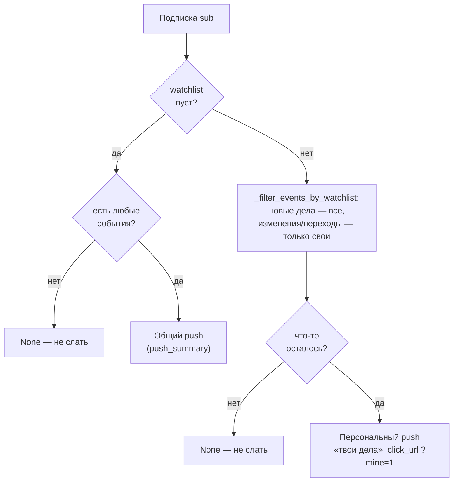

# 07. Доставка и уведомления

## Что это и зачем

Готовый дайджест нужно доставить юристу. Каналов два: **Telegram** (общий текст
для всех получателей) и **Web Push** в мобильное приложение PWA
(персонализированный — каждому подписчику только по его делам). Этот документ
объясняет, как текст попадает в оба канала и почему один коллега получает push
про дело, а другой — нет.

## Telegram

`send_telegram(text)` ([704](../../scripts/court_monitor/delivery.py#L704)) шлёт HTML
через Telegram Bot API (`parse_mode=HTML`). Особенности:

- **Лимит 4096 символов** на сообщение. Длинный дайджест режется
  `split_message` ([761](../../scripts/court_monitor/delivery.py#L761)) по границам
  абзацев, не разрывая строки и HTML-теги. Каждая часть «дозакрывается»
  (`_close_open_tags`), между частями — пауза 1 сек.
- **Фолбэк без разметки.** Если Telegram отверг сообщение (например, из-за
  кривого тега), оно переотправляется как plain-text (`re.sub('<[^>]+>','')`).
- Поддерживаются только теги `<b>`, `<i>`, `<a href>`; превью ссылок отключено.

### Куда уходит Telegram-дайджест

- **По умолчанию — личный чат** (`TELEGRAM_CHAT_ID_TEST`). Боевой `TELEGRAM_CHAT_ID`
  — корпоративная группа.
- В корпоративную группу дублируется только при галке `to_group` в UI запуска
  workflow. Текст в Telegram **общий**, не персонализированный.

(Маршрутизация по чатам задаётся на уровне workflow — см.
[10. CI/CD и эксплуатация](10-ci-cd-и-эксплуатация.md).)

## Web Push (PWA)

`send_web_push(title, body, *, click_url, owner_only, per_subscriber)`
([517](../../scripts/court_monitor/delivery.py#L517)). Отправляет push подписчикам PWA.
Механика:

1. Требует настроенных `PUSH_WORKER_URL`, `PUSH_SECRET`, `VAPID_PRIVATE_KEY` —
   иначе тихо пропускает (на локальной машине push обычно выключен).
2. Запрашивает список подписок у Cloudflare Worker (`GET /subscriptions`,
   с `?role=owner`, если `owner_only`).
3. Отправляет каждому через `pywebpush` + VAPID-ключ.

Два важных параметра:

- **`owner_only=True`** — слать только устройствам, помеченным владельческими
  (через `POST /mark-owner`). Используется в тестовых режимах (`--replay-last`,
  `--digest-only`), чтобы прототипы не улетали коллегам.
- **`per_subscriber`** — callback `(sub) → (title, body, click_url) | None`,
  строящий payload индивидуально под подписку. Это и есть персонализация.

Журнал последней рассылки пишется в `last_personal_pushes.json` (что получила
каждая подписка) — для отладки через админку. Мёртвые подписки (410 Gone)
удаляются `_drop_dead_subscription` ([216](../../scripts/court_monitor/delivery.py#L216)).

## Персонализация по watchlist

Каждый пользователь PWA может «звездить» дела (watchlist). Push должен приходить
персонально — только по своим делам. Фабрика callback'а —
`_make_per_sub_callback` ([377](../../scripts/court_monitor/delivery.py#L377)).

### Правила (что получит подписчик)

| Watchlist | События | Что отправляется |
|-----------|---------|------------------|
| пуст | нет | ничего (`None`) |
| пуст | есть любые | общий push с `push_summary` |
| непуст | есть свои изменения или новые дела | персональный push, `click_url = …?mine=1` |
| непуст | своих нет | ничего (`None`) |

### Что считается «своим»

`_filter_events_by_watchlist` ([151](../../scripts/court_monitor/delivery.py#L151))
фильтрует события по watchlist. **Ключевое правило:**

- **Новые дела общесистемны** — `fi_new_cases`, `appeal_new_cases_csv`,
  `cass_discovered` шлются **всем**, не фильтруются по watchlist.
- **Изменения и переходы стадий** (`changes`, `fi_changes`, `cass_changes`,
  `stage_transitions`) — **только** если дело в watchlist подписчика.

### Алиасы номеров дел

Одно дело имеет до 3–4 номеров (1-я инст., апелляция, кассация, hybrid-предок).
Юрист мог «зазвездить» дело по любому из них. Поэтому watchlist каждой подписки
**расширяется** через карты алиасов перед фильтрацией:

- `_build_watchlist_alias_indexes` ([45](../../scripts/court_monitor/delivery.py#L45))
  строит карты `алиас → канон` и `канон → алиасы` по всем делам (раз на прогон).
- `_expand_watchlist_via_aliases` ([134](../../scripts/court_monitor/delivery.py#L134))
  расширяет watchlist подписки всеми известными номерами её дел.
- Сравнение идёт в «базовой» форме номера (`_bare_case_number`), что закрывает
  hybrid-номера вида `2-208/2026 (2-1148/2025;)`.

После боевой рассылки `canonicalize_kv_watchlists`
([266](../../scripts/court_monitor/delivery.py#L266)) постепенно заменяет «грязные»
алиасы в KV Worker'а на канонические FI-ID — чтобы со временем вычистить мусор.
Это делается только в живом кроне, не в тестовых режимах.

## Куда уходит push в разных режимах

| Режим запуска | Telegram | Web Push |
|---------------|----------|----------|
| Основной крон (`main_json`) | личный чат (+ группа по галке) | **всем** подписчикам, персонализированно |
| `test_digest.yml` / `--replay-last` | личный чат (+ группа по галке) | **только владельцу** (галка `push_all` → всем) |

`click_url` для персонального push — `?digest=open&mine=1`: фронт открывает блок
«Последний дайджест» в mine-версии (только свои дела). Как это обрабатывает фронт
— в [08. Фронтенд](08-фронтенд.md). Хранение подписок и watchlist в KV, эндпоинт
`/subscriptions` — в [09. Cloudflare Worker](09-cloudflare-worker.md).
