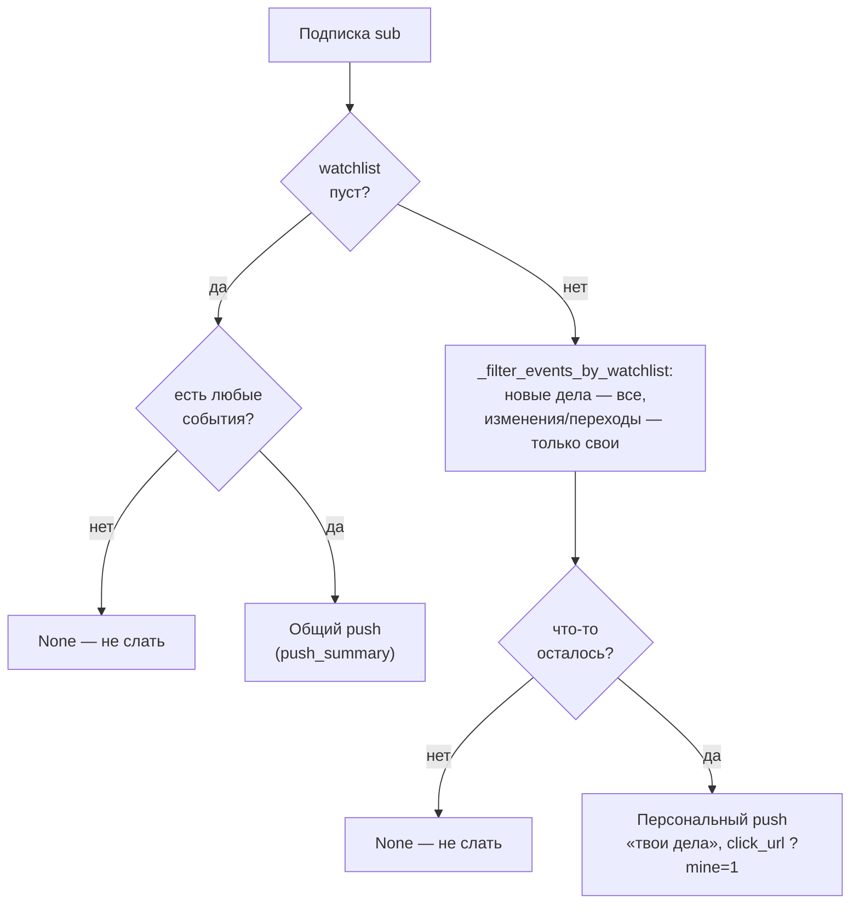

# 07. Доставка и уведомления

## Что это и зачем

Юридический дайджест доступен в приложении; персональный **Web Push** сообщает
подписчику о подходящих ему событиях. **Личный Telegram владельца** получает
технический отчёт о парсинге, пересказах и доставке. Текст дайджеста можно
направить в корпоративную Telegram-группу отдельной галкой ручного workflow.
Этот документ описывает маршруты и подтверждения каждого этапа по коду
07.10.2026. Публикация и установка подтверждаются отдельно в
[отчёте выпуска](../Выпуск_технических_отчётов_2026-10-07.md).

## Когда начинается доставка

Сверка 13.09.2026: VPS публикует данные, затем фиксирует маркер доставки
через журнал транзакции. Отдельный `court-delivery.timer` повторно проверяет
готовые выпуски с 08:45 по Екатеринбургу; `--can-deliver` допускает и
сегодняшний завершённый прогон без новых событий. Парсинг, импорт и доставка
используют общий `.run.lock` своего клона.

Push в `main` с маркером `(Mac-парсинг)` и изменением `last_digest_context.json`
запускает [replay_on_push.yml](../../.github/workflows/replay_on_push.yml),
если автор не `github-actions[bot]`; этот контракт действует и для VPS.
Replay сначала формирует дайджест для приложения, затем публикует
результат и отправляет Web Push отдельным шагом (`DEFER_WEB_PUSH=1`). Перед
push он пытается дождаться актуального содержимого Pages; при таймауте или
неудачном rebase подтверждение может отсутствовать. Не считать сам факт push
доказательством доступности новой версии страницы.

После попыток Web Push и публикации журнала финальный шаг `always()`
отправляет личный технический отчёт. Сборка, публикация Git, проверка Pages,
принятие push-сервисами и результат группового Telegram учитываются отдельно.
Маркер `delivered_at` на VPS означает передачу выпуска в GitHub, а не
завершение этой цепочки.

Расписание, повторы и восстановление — в [рантбуке VPS](../../ops/vps-run/README.md)
и [главе об эксплуатации](10-ci-cd-и-эксплуатация.md). Ниже описан транспорт
уведомлений; наличие кода не подтверждает конкретную отправку.

## Дневная дочитка и следующий выпуск

Режим выпуска 07.10 `--retry-only` публикует данные без маркера
`(Mac-парсинг)` и не запускает replay. Дельта сохраняется в
`cases.json.pending_retry_context`; уже доставленные `last_digest_context.json`,
его `delivered_at` и HTML дайджеста не переписываются. Следующий обычный
выпуск объединяет эту дельту со своими событиями, и только подтверждённая
запись полного контекста позволяет очистить очередь. Такой режим сам не
создаёт второй дневной дайджест или Web Push. После публикации дочитки
служебный `retry-result` может направить короткий технический результат:
существенный прирост чтения, новые события для следующего выпуска, новую
проблему или восстановление. Одинаковые сообщения подавляются.

При незавершённой транзакции доставки дневной режим откладывается до её
штатного восстановления. Действует общий `.run.lock` территории. Установка
новых таймеров VPS и факт доставки проверяются отдельно от наличия кода.

## Telegram

### Личный технический канал

За отчёт отвечают [technical_report.py](../../scripts/court_monitor/technical_report.py)
и отдельный [CLI](../../scripts/technical_report.py). `TELEGRAM_DIGEST_MODE=technical`
исключает личный текст дайджеста. Workflows сохраняют результаты этапов в
`$RUNNER_TEMP/court-technical-report.json`; `DEFER_TECHNICAL_REPORT=1` откладывает
сообщение до финального шага. JSON относится к региону, ID и попытке Actions,
очищается перед запуском и не подменяется прошлым успешным выпуском.

Отчёт показывает дневное покрытие по трём инстанциям, поиск, очереди,
события, фактические модели пересказов и причины резервов, публикацию,
результаты push и необходимые действия. Использование кэша обозначается
отдельно; его исходная модель не считается новым обращением. Подробный
JSON и HTML сохраняются артефактом Actions на 7 дней. Состав и ограничения —
в [контракте технических отчётов](../Технические_отчёты.md).

Финальный CLI использует стандартную библиотеку и работает после сбоя
установки зависимостей. Если checkout не принёс его файл, workflow отправляет
короткий резервный сигнал. При наличии CLI второй сигнал не создаётся даже
при неуспешной отправке отчёта. Календарный пропуск и тест без публикации
отмечаются как штатный пропуск. Ошибка прогона в отложенном режиме входит
в итоговый отчёт; прежний немедленный crash-алерт не дублируется.

### Текст дайджеста в выбранном чате

`send_telegram(text)` ([delivery.py](../../scripts/court_monitor/delivery.py)) шлёт HTML
через Telegram Bot API (`parse_mode=HTML`). Особенности:

- **Лимит 4096 символов** на сообщение. Длинный дайджест режется
  `split_message` ([delivery.py](../../scripts/court_monitor/delivery.py)) по границам
  абзацев, не разрывая строки и HTML-теги. Каждая часть «дозакрывается»
  (`_close_open_tags`), между частями — пауза 1 сек.
- **Фолбэк без разметки.** Если Telegram отверг сообщение (например, из-за
  кривого тега), оно переотправляется как plain-text (`re.sub('<[^>]+>','')`).
- Поддерживаются только теги `<b>`, `<i>`, `<a href>`; превью ссылок отключено.
- Результат содержит число принятых и не принятых частей. Успех требует
  положительного `ok` Telegram API; частичная отправка не считается полной.

### Куда уходит Telegram-дайджест

- Штатный `replay_on_push.yml` направляет в `TELEGRAM_CHAT_ID_TEST` только
  финальный технический отчёт; переключателя `to_group` здесь нет.
- Ручные `update_cases.yml` и `test_digest.yml` выбирают адрес через `to_group`:
  без галки текст дайджеста в Telegram не уходит; с галкой его получает
  `TELEGRAM_CHAT_ID` в режиме `digest`. Личный технический отчёт адресуется
  `TELEGRAM_CHAT_ID_TEST` независимо от этой галки, без копии юридического текста.
  Групповой текст не персонализируется. Фактические адресаты зависят от
  секретов своей территории.

Без явного `TELEGRAM_DIGEST_MODE` личный канал определяется по совпадению
`TELEGRAM_CHAT_ID_PERSONAL` и адресата либо по положительному chat ID.
Режим `digest` позволяет явно сохранить отправку текста в выбранный чат.

(Маршрутизация по чатам задаётся на уровне workflow — см.
[10. CI/CD и эксплуатация](10-ci-cd-и-эксплуатация.md).)

## Web Push (PWA)

`send_web_push(title, body, *, click_url, owner_only, per_subscriber)`
([delivery.py](../../scripts/court_monitor/delivery.py)). Отправляет push подписчикам PWA.
Механика:

1. Требует настроенных `PUSH_WORKER_URL`, `PUSH_SECRET`, `VAPID_PRIVATE_KEY` —
   иначе возвращает `not_configured` (на локальной машине push обычно выключен).
2. Запрашивает список подписок у Cloudflare Worker (`GET /subscriptions`,
   с `?role=owner`, если `owner_only`).
3. Отправляет каждому через `pywebpush` + VAPID-ключ.

Два важных параметра:

- **`owner_only=True`** — слать только устройствам, помеченным владельческими
  (через `POST /mark-owner`). Используется в тестовых режимах (`--replay-last`,
  `--digest-only`), чтобы прототипы не улетали коллегам.
- **`per_subscriber`** — callback `(sub) → (title, body, click_url) | None`,
  строящий payload индивидуально под подписку. Это и есть персонализация.

Журнал последней рассылки пишется в `last_personal_pushes.json`: payload
каждой подписки дополнен `delivery_status` (`attempted`, `accepted`, `failed`,
`skipped`), а `delivery` содержит агрегаты результата. Наличие payload само
по себе не доказывает отправку. `accepted` означает принятие push-сервисом,
не показ или прочтение человеком. Числа подписок, попыток, принятых сообщений,
ошибок и пропусков различаются; подписка — устройство/браузер, не человек.
Мёртвые подписки (404/410) удаляются `_drop_dead_subscription`
([delivery.py](../../scripts/court_monitor/delivery.py)).

## Персонализация по watchlist

Каждый пользователь PWA может «звездить» дела (watchlist). Push должен приходить
персонально — только по своим делам. Фабрика callback'а —
`_make_per_sub_callback` ([delivery.py](../../scripts/court_monitor/delivery.py)).

### Правила (что получит подписчик)

```mermaid
flowchart TD
    S["Подписка sub"] --> WL{"watchlist<br/>пуст?"}
    WL -->|да| G{"есть любые<br/>события?"}
    G -->|нет| N1["None — не слать"]
    G -->|да| GEN["Общий push<br/>(push_summary)"]
    WL -->|нет| F["_filter_events_by_watchlist:<br/>новые дела — все,<br/>изменения/переходы — только свои"]
    F --> H{"что-то<br/>осталось?"}
    H -->|нет| N2["None — не слать"]
    H -->|да| PER["Персональный push<br/>«твои дела», click_url ?mine=1"]
```

| Watchlist | События | Что отправляется |
|-----------|---------|------------------|
| пуст | нет | ничего (`None`) |
| пуст | есть любые | общий push с `push_summary` |
| непуст | есть свои изменения или новые дела | персональный push, `click_url = …?mine=1` |
| непуст | своих нет | ничего (`None`) |

### Что считается «своим»

`_filter_events_by_watchlist` ([delivery.py](../../scripts/court_monitor/delivery.py))
фильтрует события по watchlist. **Ключевое правило:**

- **Новые дела общесистемны** — `fi_new_cases`, `appeal_new_cases_csv`,
  `cass_discovered` шлются **всем**, не фильтруются по watchlist.
- **Изменения и переходы стадий** (`changes`, `fi_changes`, `cass_changes`,
  `stage_transitions`) — **только** если дело в watchlist подписчика.

### Алиасы номеров дел

Одно дело имеет до 3–4 номеров (1-я инст., апелляция, кассация, hybrid-предок).
Юрист мог «зазвездить» дело по любому из них. Поэтому watchlist каждой подписки
**расширяется** через карты алиасов перед фильтрацией:

- `_build_watchlist_alias_indexes` ([delivery.py](../../scripts/court_monitor/delivery.py))
  строит карты `алиас → канон` и `канон → алиасы` по всем делам (раз на прогон).
- `_expand_watchlist_via_aliases` ([delivery.py](../../scripts/court_monitor/delivery.py))
  расширяет watchlist подписки всеми известными номерами её дел.
- Сравнение идёт в «базовой» форме номера (`_bare_case_number`), что закрывает
  hybrid-номера вида `2-208/2026 (2-1148/2025;)`.

После боевой рассылки `canonicalize_kv_watchlists`
([delivery.py](../../scripts/court_monitor/delivery.py)) постепенно заменяет «грязные»
алиасы в KV Worker'а на канонические FI-ID — чтобы со временем вычистить мусор.
Это делается только в живом кроне, не в тестовых режимах.

## Куда уходит push в разных режимах

| Режим запуска | Telegram | Web Push |
|---------------|----------|----------|
| Штатный `replay_on_push.yml` после VPS | личный технический отчёт после всех этапов | **всем** подписчикам, персонализированно; после попытки подтверждения Pages |
| Ручной `update_cases.yml` (`main_json`) | личный технический отчёт; дайджест в группу по `to_group` | **всем** подписчикам, персонализированно; отправка встроена в Python-прогон |
| `test_digest.yml` | личный технический отчёт; дайджест в группу по `to_group` | только при `commit_results=true`: **владельцу**, `push_all` → всем |
| Прямой `--replay-last` | определяется адресатом и `TELEGRAM_DIGEST_MODE` | **владельцу**, `--push-all` → всем; при `DEFER_WEB_PUSH=1` откладывается |

## Служебные сообщения исполнителя

После успешной публикации обычного прогона `parse-result` сохраняет базу
сравнения; при ранее подтверждённом сбое сообщает о восстановлении.
`retry-result` сообщает только о существенном результате дочитки или новой
проблеме. Ошибки оболочки идут отдельным `failure`, повторяются лишь до
подтверждения Telegram и снова уведомляют после нового сбоя вслед за
восстановлением. Эти сообщения не запускают юридическую рассылку.

Существующая служба доставки вызывает `watchdog` до быстрого выхода.
После 10:00 по Екатеринбургу он проверяет наличие подтверждённого завершения
с публикацией данных. Свежего `parse_health.json` недостаточно. Живой владелец
`.run.lock` учитывается; остановку всего VPS или самой службы доставки этот
локальный контроль обнаружить не может. Новый таймер для отчёта не нужен.
Правила дедупа, хранения состояния и порогов — в
[контракте](../Технические_отчёты.md#сообщения-исполнителя-vpsmac).

`click_url` для персонального push — `?digest=open&mine=1`: фронт открывает блок
«Последний дайджест» в mine-версии (только свои дела). Как это обрабатывает фронт
— в [08. Фронтенд](08-фронтенд.md). Хранение подписок и watchlist в KV, эндпоинт
`/subscriptions` — в [09. Cloudflare Worker](09-cloudflare-worker.md).
